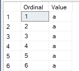
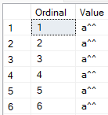

# Eliminate Your Blockers
Picture this: you're ready to unleash your groundbreaking SQL code, only to find it blocked at every turn. Suddenly, you’re the "hero" of the office, staring intensely at [sys.dm_exec_requests]](https://learn.microsoft.com/en-us/sql/relational-databases/system-dynamic-management-views/sys-dm-exec-sessions-transact-sql), identifying blocking sessions like a detective in a mystery novel, and manually [KILL](https://learn.microsoft.com/en-us/sql/t-sql/language-elements/kill-transact-sql)ing them one by one. You look extremely professional, your keyboard clattering like a hacker in a blockbuster movie.

Finally, drenched in sweat, you emerge victorious. Your code runs! But at what cost?

Well, let’s save you the drama (and the caffeine jitters).

Enter [z.usp_RemoveBLocker](References#zusp_removeblocker) - your personal SQL bodyguard. Think of it as the bouncer for your code: it launches a [service job](./Service%20Jobs.md) that hunts down those pesky blockers and gives them the boot. But it’s a classy bouncer—it knows when to leave. The moment your session goes idle (no queries running), the job automatically removes itself, leaving no trace.

Need to vanquish blockers again? Just summon [z.usp_RemoveBLocker](References#zusp_removeblocker) once more.

Here’s how it works:
``` sql
exec z.usp_RemoveBLocker
/*
your crazy workload
*/
```
No more frantic typing. No more "busy hero" moments. Just you, your SQL, and blockers learning to stay out of your way. Do you like it?

# Remove Objects

When removing an object in SQL Server, you can use following approaches:
``` sql
if object_id('obj1') is not null
	drop table obj1;
```
or
``` sql
drop table if exists obj1;
```
In both examples, you need to know the type of the object being dropped. However, for certain object types, such as queues, `drop queue if exists` statement does not exists. 

The procedure [z.usp_DropObject](References#zusp_dropobject) simplifies this by allowing you to drop any user-defined object listed in [sys.objects](https://learn.microsoft.com/en-us/sql/relational-databases/system-catalog-views/sys-objects-transact-sql). For example:
``` sql
exec z.usp_DropObject 'obj1'
```

# Remove Temp Tables
[Local temporary tables](https://learn.microsoft.com/en-us/sql/t-sql/statements/create-table-transact-sql#temporary-tables) are the unsung heroes of SQL programming — created in a flash, used extensively, and then often... left behind like forgotten leftovers in the fridge. Imagine a long script that creates temporary tables and references them throughout. Once executed, if you need to run it again in the same session, you'll first have to remove those pesky temp tables before recreating them.

Most people write cleanup code at the beginning or end of their scripts, like this classic approach:
``` sql
if object_id('tempdb..#MyTemp') is not null
	drop table #MyTemp
```
This works - but who has time to babysit temp tables when Schema z can handle it for you?

With procedure [z.usp_DropAllLocalTempTables](References#zusp_dropalllocaltemptables), you can effortlessly remove all local temporary tables in one go. No more hunting them down manually.

``` sql
select * into #MyTemp from sys.objects
go
select object_id('tempdb..#MyTemp')
go
exec z.usp_DropAllLocalTempTables
go
select object_id('tempdb..#MyTemp')

/*
(344 rows affected)

-----------
-1544820000

(1 row affected)


-----------
NULL

(1 row affected)
*/
```
Now you can focus on writing SQL instead of chasing down temp tables. 


# String Operations

Schema z introduces objects manipulating strings and simplifies your work.

- [z.fn_LettersOnly](References#zfn_lettersonly)
As its name, this function returns letters in the string
``` sql
select z.fn_LettersOnly('Hello World 123')
-- HelloWorld
```

- [z.fn_NumbersOnly](References#zfn_numbersonly)
As its name, this function returns letters in the string
``` sql
select z.fn_NumbersOnly('Hello World 123')
-- 123
```

- [z.fn_SplitString](References#zfn_splitstring)

This is an enhanced version of [string_split](https://learn.microsoft.com/en-us/sql/t-sql/functions/string-split-transact-sql). It allows multiple characters in the separator which is only one character supported in [string_split](https://learn.microsoft.com/en-us/sql/t-sql/functions/string-split-transact-sql). Recursive [CTE](https://learn.microsoft.com/en-us/sql/t-sql/queries/with-common-table-expression-transact-sql) is used Internally in this function, if the string contains over 100 separated values, [MaxRecursion](https://learn.microsoft.com/en-us/sql/t-sql/queries/with-common-table-expression-transact-sql) query option must be set to zero.
``` sql
declare @LongString nvarchar(max) = replicate('a^^', 300)
select *
from z.fn_SplitString(@LongString, '^^')
option(MaxRecursion 0)
```


- [z.fn_SplitStringFixedLength](References#zfn_splitstringfixedlength)

As its name, this function splits string by length. Recursive [CTE](https://learn.microsoft.com/en-us/sql/t-sql/queries/with-common-table-expression-transact-sql) is used Internally in this function, if the string contains over 100 fixed length values, [MaxRecursion](https://learn.microsoft.com/en-us/sql/t-sql/queries/with-common-table-expression-transact-sql) query option must be set to zero.

``` sql
declare @LongString nvarchar(max) = replicate('a^^', 300)
select *
from z.fn_SplitStringFixedLength(@LongString, 3)
option(MaxRecursion 0)
```


- [z.fn_SecondsToTimeString](References#zfn_secondtotimestring)

This function converts number of seconds to clock-style format, `days.hh:mi:ss`.
``` sql
select z.fn_SecondsToTimeString(98765)
-- 1.03:26:05
```

- [z.usp_PrintString](References#zusp_printstring)
This procedures helps print a string.

