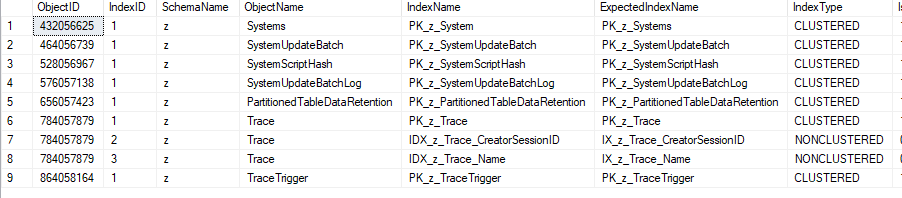

The importance of object naming convention in a database system is a well known subject which will not be discussed in this article. Instead, this article focuses on how it's defined and enforced in Schema Z. 

To enforce the naming conventions, function [z.fn_GetExpectedName](References#zfn_getexpectedname) generates standard names for database objects. This function is referenced by views [z.v_DefaultConstraints](References#zv_defaultconstraints), [z.v_ForeignKeys](References#zv_foreignkeys), and [z.v_Indexes](References#zv_indexes). In the example below, the `ExpectedName` column is populated by this function. 

``` sql
select * from z.v_Indexes where SchemaName = 'z'
```



When the procedure [z.usp_ForceNamingConvention](References#zusp_forcenamingconvention) is executed, it identifies objects with names that do not match their expected names, and renames them using procedure [sp_rename](https://learn.microsoft.com/en-us/sql/relational-databases/system-stored-procedures/sp-rename-transact-sql).


The Procedure [z.usp_ForceNamingConvention](References#zusp_forcenamingconvention) applies naming conventions to objects in schemas defined in table [z.DatabaseSchemas](References#zdatabaseschemas). By default, only objects in schema `z` will be affected. if a specific table name is passed to the procedure, the table [z.DatabaseSchemas](References#zdatabaseschemas) will **not** be checked.

To customized the naming conventions, you can modify the function [z.fn_GetExpectedName](References#zfn_getexpectedname). you may also need to adjust the views [z.v_DefaultConstraints](References#zv_defaultconstraints), [z.v_ForeignKeys](References#zv_foreignkeys), and [z.v_Indexes](References#zv_indexes).


## Indexes
In Schema z, index names are designed to reflect key columns and type of the indexes (e.g. primary key, unique key, XML index, column store index). However, hte naming convention does not indicate whether an index is clustered, as primary keys are the clustered key of a table in most of the cases.

- Indexes: `IX_SchemaName_ObjectName_KeyColumnName1_KeyColumnName2...`, if two indexes have the same key columns but different included or filtered columns, the procedure [z.usp_ForceNamingConvention](References#zusp_forcenamingconvention) will fail since the expected names are identical.

- Primary key: `PK_SchemaName_ObjectName`

- Unique keys: `UQ_SchemaName_ObjectName_KeyColumnName1_KeyColumnName2...` 

- Columnstore indexes: Only one column store index is allowed per table.
  - None-clustered: `NCI_SchemaName_ObjectName` 
  - clustered: `CCI_SchemaName_ObjectName` 

- XML indexes: 
    - Primary XML index : `IX_XML_PR_SchemaName_ObjectName_XMLColumnName`
    - Secondary XML on Path: `IX_XML_P_SchemaName_ObjectName_XMLColumnName`
    - Secondary XML on Value: `IX_XML_V_SchemaName_ObjectName_XMLColumnName`
    - Secondary XML on Property: `IX_XML_R_SchemaName_ObjectName_XMLColumnName`

## Foreign Keys
For Foreign Keys, the naming convention includes the parent object, referencing column, and referenced object. In most of the case, referenced columns are primary keys in the referenced table, so they are not included in the naming convention

- When referenced object's schema is different from referencing object's schema: `FK_SchemaName_ObjectName_ReferencedSchemaName_ReferencedObjectName_ReferencingCol1_ReferencingCol2...`.

- When schemas are then same: `FK_SchemaName_ObjectName_ReferencedObjectName_ReferencingCol1_ReferencingCol2...`.

## Defaults
Naming convention for default is straightforward, `FK_SchemaName_ObjectName_DefaultColumnName`.

