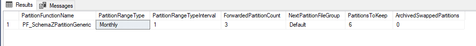
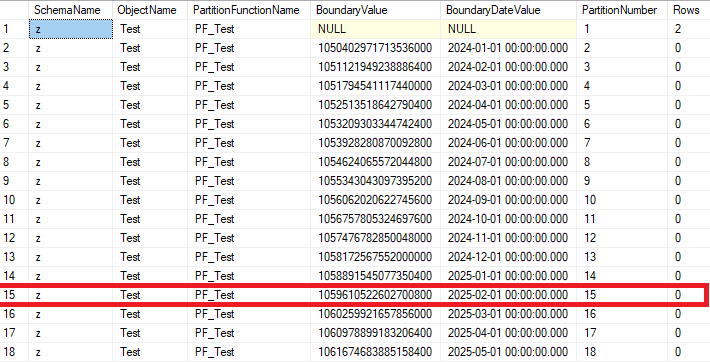
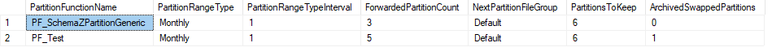

# Overview

Table partitions is a powerful feature that simplifies data maintenance and improves performance. In most cases, partition management involves following tasks:

1. **Adding new partitions:** Define the next file group to use and split the range.
2. **Removing old partitions:** Create an new table with the same table structure, swap out the partition to the new table.
3. **Archiving or Removing swapped-out old partitions:** Export the swapped-out table to archive servers, and remove the swapped-out table.

Schema z automates these partition management tasks based on configuration table [z.PartitionedTableDataRetention](References#zpartitionedtabledataretention).

``` sql
select * from z.PartitionedTableDataRetention;
```


The partition function `PF_SchemaZPartitionGeneric` and its associated partition scheme `PS_SchemaZPartitionGeneric`
are designed for table under Schema `z`, including logs, traces, and historical data. Based on the retention policy, the partitioning follows a `monthly` structure: `3` future partitions, `6` past partitions, and `1` current partition. This results in max `10` partitions in the table. 

The `ArchivedSwappedPartitions` column determines the handling of swapped-out partitions. 
-`1` : The ETL process(currently in development) will copy the data to an archive server before removing swapped-out tables.
-`0` : The swapped-out tables are removed immediately
-`null` : The swapped-out table is retained.

The stored procedure [z.usp_ForcePartitionRetentionPolicy](References#zusp_forcepartitionretentionpolicy) reads the configuration from this table and manages partition creation and removal. This procedure [can be scheduled](Service-jobs#creat-a-job) to run daily but It's not scheduled by default. 

## Encoded Bigint

Schema z defines `bigint` data type as a combination of a datetime component and a sequence number. - **Upper 36 bit:** Store number of seconds since `1900-01-01` allowing date storage up to `2988-10-25`. 
- **Lower 28 bits:** Store the sequence numbers with maximum of `268,435,455` per second.

``` sql
select getutcdate(), z.fn_GetZSequenceID(next value for z.SeqGeneralID)
/* 
----------------------- --------------------
2025-02-06 19:00:11.220 1059744850657673226

(1 row affected)
*/
```
``` sql
select *
from z.fn_DecodeZSequenceID(1059744850657673226)

/*
Date                    Sequence
----------------------- --------------------
2025-02-06 19:00:11.000 10

(1 row affected)
*/
```
This encoding scheme is designed for table partitioning, allowing datetime-partitioned tables to use a single bigint column as the clustered index key. The limitation is the sequence number is capped at `268,435,455`.

# Migrate to a Partitioned Table
This section explains how Schema z procedures assist in managing table partitions

Let's assume `z.Text` is a very large table containing billions of records. Copying data to a partitioned table using traditional method could take months. Instead, we can use partition switching to efficiently move the entire table into the first partition of a new partitioned table.

**Create the None-Partitioned Table**
``` sql
create table z.Test
(
	ID bigint identity(1,1) not null,
	Date datetime not null,
	OtherFields varchar(10),
	constraint PK_z_Test primary key(ID),
	index IX_z_Test_Date(Date)
)
insert into z.Test(Date, OtherFields) values('2024-06-02', 'Value1')
insert into z.Test(Date, OtherFields) values('2024-10-02', 'Value2')
select * from z.Test
```
Table content:
|ID|Date|OtherFields|
|---|---|---|
|1|2024-06-02 00:00:00.000|Value1|
|2|2024-10-02 00:00:00.000|Value2|

**Create Partition Function and Scheme:**
``` sql
if not exists(select * from sys.partition_functions where name = 'PF_Test')
	create partition function PF_Test (bigint) as range left for values();
go
if not exists(select * from sys.partition_schemes where name = 'PS_Test')
	create partition scheme PS_Test as partition PF_Test all to ([Default])
go
```

**Migrate data using Partition Switching**
``` sql
declare @SQL nvarchar(max)
begin tran
--Copy z.Test schema to z.Text_New on PS_Test partition scheme
exec z.usp_CopyTableSchema @FullSourceTableName = 'z.Test', @FullTargetTableName = 'z.Test_New', @FileGroupOrPartitionScheme = 'PS_Test(ID)', @CopyIdentity = 0
--Create 3 partitions in the future
exec z.usp_CreatePartitionForDateRange @PartitionFunctionName = 'PF_Test', @PartitionRangeType = 'Monthly', @NumberOfPartitions = 3
-- add default constraint to the z.Test_New.ID column
alter table z.Test_New add constraint DF_z_Test_New_ID default (datediff_big(second, '1900-01-01', getutcdate()) * 268435456 | next value for z.SeqGeneralID) for ID;
--Create a check constraint on z.Test and ensure the ID value is smaller than the smallest partition boundary value.
select @SQL = 'alter table z.Test add constraint CK_z_Test check (ID < '+cast(min(BoundaryValue) as nvarchar(100)) + ')'
from z.v_PartitionedIndexes where ObjectName = 'Test_New' and IndexID = 1
exec(@SQL) -- alter table z.Test add constraint CK_z_Test check (ID < 1059610522602700800)
-- Move z.Test to z.Test_New
alter table z.Test switch to z.Test_New partition 1;
--Remove z.Test table
exec z.usp_DropObject 'z.Test'
--Rename z.Test_New table to z.Test
exec sp_rename 'z.Test_New', 'Test', 'Object';
--Ensure index and default constraint names conform the naming convention.
exec z.usp_ForceNamingConvention 'z.Test'
commit
```

**Verify Migration**
``` sql
select SchemaName, ObjectName, PartitionFunctionName, BoundaryValue, BoundaryDateValue, PartitionNumber, Rows
from z.v_PartitionedIndexes 
where ObjectName = 'Test' and IndexID = 1 
order by PartitionNumber
```

Now, the records have been successfully migrated to the First partition of the new partitioned table.

The partition key must be included in any non-clustered unique constraints and unique indexes. If a non-clustered unique index exists on the original table, remove it first, then create it including the partition key to maintain partition alignment.

**Add More Partition to Table**
``` sql
exec z.usp_CreatePartitionForDateRange @PartitionFunctionName = 'PF_Test', @PartitionRangeType = 'Monthly', @DateFrom = '2024-01-01', @DateTo = '2025-01-01'

select SchemaName, ObjectName, PartitionFunctionName, BoundaryValue, BoundaryDateValue, PartitionNumber, Rows
from z.v_PartitionedIndexes
where ObjectName = 'Test' and IndexID = 1 
order by PartitionNumber
```


**Create Retention Policy**
The policy specifies the creation of 5 future partitions while retaining 6 past partitions.
``` sql
insert into z.PartitionedTableDataRetention(PartitionFunctionName, PartitionRangeType, PartitionRangeTypeInterval, ForwardedPartitionCount, NextPartitionFileGroup, PartitionsToKeep, ArchivedSwappedPartitions)
	values('PF_Test', 'Monthly', 1, 5, 'Default', 6, 1)
select * from z.PartitionedTableDataRetention
```


**Apply Policies**
``` sql
exec z.usp_ForcePartitionRetentionPolicy

select SchemaName, ObjectName, PartitionFunctionName, BoundaryValue, BoundaryDateValue, PartitionNumber, Rows
from z.v_PartitionedIndexes
where ObjectName = 'Test' and IndexID = 1 
order by PartitionNumber
```
There are 6 partitions before current partition and 5 after it.


Check swapped-out tables

``` sql
select schema_name(schema_id) SchemaName,* 
from sys.tables t
where name like '%partition%' 
order by 1, 2
```
