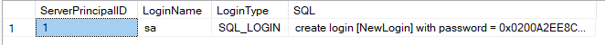
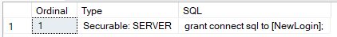
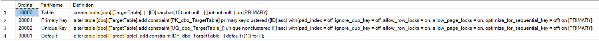
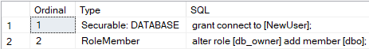
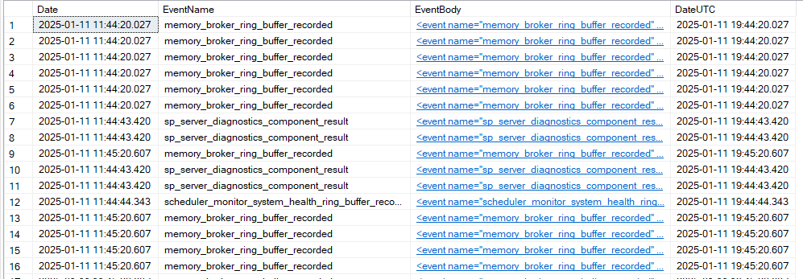
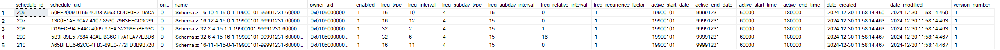
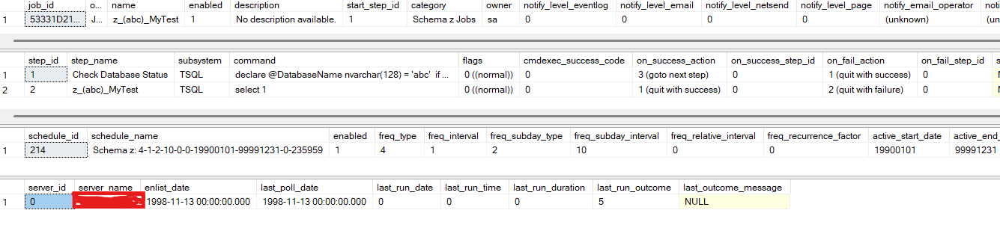
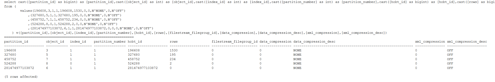
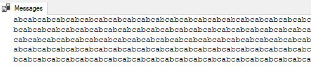

# Functions (Scaler-Valued)

## z.fn_GenerateRandomDate

This function generates a random date within a specified date range. The randomness is determined by a provided floating-point number between 0 and 1. If the date range is not specified, the function defaults to generating dates within a range of one year ago to one year in the future.

**Arguments**

***@Rand*** *float*, A random number between 0 and 1 used to calculate the random date. 

***@DateFrom*** *datetime*, The start date for the range. Default to a year ago if NULL.

***@DateTo*** *datetime*, The end date for the range.Default to a year from now if NULL.

***Return Data Type: datetime***

**Examples**
``` sql
select z.fn_GenerateRandomDate(rand(), null, null)
/*
-----------------------
2024-11-13 20:01:56.033

(1 row affected)
*/
```

## z.fn_GenerateZSequenceID
This function generates a Schema z encoded Sequence ID based on a given datetime and sequence number. The result is a bigint value that encodes both datetime and the sequence number provided.

**Arguments**

***@Date*** *datetime*, The datetime in the encoded sequence number.

***@SeqGeneralID*** *bigint* The sequence number  in the sequence number 

***Return Data Type: bigint***

**Algorithm**
The function encodes the sequence ID using the formula below. If the sequence number exceeds 268435456 (2^28) for the same second, the encoded sequence ID may produce duplicates. 

``` sql
DATEDIFF_BIG(second, '1900-01-01', @Date) * 268435456 | @SeqGeneralID
```

**Examples**
``` sql
select z.fn_GenerateZSequenceID('2022-02-02 22:22:22', 1000)
/*
--------------------
1034236001309950952

(1 row affected)
*/
```

## z.fn_GetExpectedName
This function generates a standardized name for an object or index based on its attributes. By applying a consistent naming convention, this function ensure that objects or indexes with the same set of attributes are always assigned the same name. It is primarily intended for enforcing naming convention with Schema Z but can be adapted to align with custom conventions.

**Arguments**

***@Type*** *varchar(50)*, Specifies the type of the object. It can be Index, UniqueKey, PrimaryKey, NONCLUSTERED COLUMNSTORE, CLUSTERED COLUMNSTORE, ForeignKey, Default, PRIMARY_XML, SECONDARY_XML_PATH, SECONDARY_XML_VALUE, and SECONDARY_XML_PROPERTY.

***@ParentSchemaName*** *nvarchar(128)*, Specifies the schema name of the parent object.

***@ParentObjectName*** nvarchar(128), Specifies the name of the parent object object.

***@Columns*** *nvarchar(max)*, Specifies the columns referenced by the object or index separated by commas. Use NULL for columnstore indexes.

***@ReferencedSchemaName*** *sysname*, Specifies the schema name of the referenced object for foreign keys.

***@ReferencedObjectName*** *sysname*, Specifies the name of the the referenced object name for foreign keys.

***Return Data Type: nvarchar(128)***

**Schema z naming convention**

***Index***: `IX_SchemaName_ObjectName_IndexCol1_IndexCol2...`, Excludes included columns and filter conditions. Avoid duplicate index keys with different included columns or filters.

***UniqueKey***: `UQ_SchemaName_ObjectName_KeyCol1_KeyCol2...`, Excludes included columns and filter conditions. Avoid duplicate index keys with different included columns or filters.

***PrimaryKey***: `PK_SchemaName_ObjectName`, Key columns are not specified in the name.

***NONCLUSTERED COLUMNSTORE***: `NCI_SchemaName_ObjectName`, Key columns are not specified in the name.

***CLUSTERED COLUMNSTORE***: `CCI_SchemaName_ObjectName`, Key columns are not specified in the name.

***ForeignKey***: `FK_SchemaName_ObjectName_ReferencedSchemaName_ReferencedObjectName_ReferencingCol1_ReferencingCol2...`, Includes referenced schema name when different from the foreign key schema.

***ForeignKey***: `FK_SchemaName_ObjectName_ReferencedObjectName_ReferencingCol1_ReferencingCol2...`, Excludes referenced schema name when same as the foreign key schema.

***Default***, `FK_SchemaName_ObjectName_DefaultColumnName...`, Only one column should be involved in a default object.

***PRIMARY_XML***, `IX_XML_PR_SchemaName_ObjectName_XMLColumnName`, Only one XML column should be involved.

***SECONDARY_XML_PATH***: `IX_XML_P_SchemaName_ObjectName_XMLColumnName`, `Only one XML column should be involved.

***SECONDARY_XML_VALUE***: `IX_XML_V_SchemaName_ObjectName_XMLColumnName`, Only one XML column should be involved.

***SECONDARY_XML_PROPERTY***: `IX_XML_R_SchemaName_ObjectName_XMLColumnName`, Only one XML column should be involved.

**Examples**
``` sql
select z.fn_GetExpectedName('Index', 'z', 'test', 'col1,col2', null, null) ExpectedName;
/*
ExpectedName
----------------------
IX_z_test_col1_col2

(1 row affected)
*/
```

**Related Topics**

[z.usp_ForceNamingConvention](#zusp_ForceNamingConvention)

## z.fn_GetFullErrorMessage
This function retrieves and composes a detailed error message from a code execution when an error occurs within the scope of a **TRY...CATCH** block. It is particularly useful for login or debugging purposes, as it consolidates information about the error, including message, security, state and line number.

**Arguments**

None

***Return Data Type: nvarchar(max)***

**Examples**

``` sql
begin try
raiserror('My error message.', 16, 1)
end try
begin catch
	print z.fn_GetFullErrorMessage()
end catch
/*
Msg 50000, Level 16, State 1, Line 2
My error message.
*/
```
When there is no error.
``` sql
print z.fn_GetFullErrorMessage()
/*
Msg , Level , State , Line 
(NULL)
*/
```

## z.fn_GetLastCommittedRowVersion
This function calculates the row version immediately preceding the current minimum active row version , [min_active_rowversion()](https://learn.microsoft.com/en-us/sql/t-sql/functions/min-active-rowversion-transact-sql). It is particularly useful for scenarios requiring precise identification of committed data boundaries, such as ETL processes.

**Arguments**

None

***Return Data Type: binary(8)***

## z.fn_GetPeriodStart

This function calculates the starting date of a specified period for a given date. It supports various period type, intervals, and optional custom starting date to accommodate flexible date calculation. The function also considers the **@@datefirst** setting for weekly period

**Arguments**

***@Date*** *datetime*, Specifies the date for which the starting date of the period is to be calculated.

***@Period*** *varchar(20)*, Specifies the period type. Valid options are **Second**, **Minute**, **Hourly**, **Daily**, **Weekly**, **Monthly**, and **Yearly**.

***@Interval*** *int*, Specifies the number of ***@Period***, for example, if ***@Period*** = minute and ***@Interval*** = 5, it returns the start time of the 5 minute interval.

***@StartDate*** *datetime2* = null, Specifies the custom base date to calculate the period. If NULL, it defaults to January 1, 0006 (a Sunday).

***Return Data Type: datetime***

**Behavior**

- **Weekly period**: The function adjust calculation of the period start based on the value of **@@datefirst**. This ensures that the returned start date aligns with the specified first day of the week.
- **Intervals**: The **@Interval** parameter allows for multi-period calculation. For example:
	- A 3-month interval(@Period = 'Monthly', @Interval = 1) would return the start date of the quarter.
	- A 5-minute interval(@Period = 'Minute', @Interval = 5) would return the start of the nearest 5-minute segment.
- **Custom Start Date**: The optional **@StartDate** parameter is useful for scenarios like fiscal calendar calculation. For example, to calculate the start of the fiscal quarters if the fiscal year begins in April.

**Examples**

``` sql
select z.fn_GetPeriodStart('2024-12-26 14:07:30', 'Minute', 5, null);
-- Returns: 2024-12-26 14:05:00 (Start of the 5-minute interval)
```
``` sql
set datefirst 1; -- Set Monday as the first day of the week
select z.fn_GetPeriodStart('2024-12-26', 'Weekly', 1, null);
-- Returns: 2024-12-23 (Monday, start of the week)
```
``` sql
select z.fn_GetPeriodStart('2024-12-26', 'Monthly', 3, '2024-01-01');
-- Returns: 2024-10-01 (Start of the current quarter based on a 3-month interval)

select z.fn_GetPeriodStart('2024-12-26', 'Monthly', 3, '2024-02-01');
-- Returns: 2024-11-01 (Start of the current quarter based on a 3-month interval)
```

## z.fn_GetServiceJobID
This function retrieves the **SQL Agent Job ID** based on **Schema z** service job name. The naming convention for Schema z job is **z_(DatabaseName)_ServiceJobName**. If the specified SQL Agent Job does not exist, the function returns NULL.

***@Name*** *nvarchar(255)*, Specifies the service job name(Excluding the **z_(DatabaseName)_**).

***Return Data Type: uniqueidentifier***

**Related Topics**

[z.fn_GetServiceJobName](#zfn_GetServiceJobName),  [z.usp_CreateServiceJob](#zusp_CreateServiceJob), [z.usp_EnableServiceJob](#zusp_EnableServiceJob), [z.usp_DisableServiceJob](#zusp_DisableServiceJob), [z.usp_RemoveServiceJob](#zusp_RemoveServiceJob), [z.usp_StartServiceJob](#zusp_StartServiceJob), [z.usp_StopServiceJob](#zusp_StopServiceJob)


## z.fn_GetServiceJobName
This function construct the SQL Agent Job Name using the Schema z service job naming convention. The resulting job name is formatted as **z_(DatabaseName)_ServiceJobName**.

***@Name*** *nvarchar(255)*, Spedifies the service job name(Excluding the **z_(DatabaseName)_**).

***Return Data Type: nvarchar(255)***

**Related Topics**

[z.fn_GetServiceJobID](#zfn_GetServiceJobID), [z.usp_CreateServiceJob](#zusp_CreateServiceJob), [z.usp_EnableServiceJob](#zusp_EnableServiceJob), [z.usp_DisableServiceJob](#zusp_DisableServiceJob), [z.usp_RemoveServiceJob](#zusp_RemoveServiceJob), 
[z.usp_StartServiceJob](#zusp_StartServiceJob), [z.usp_StopServiceJob](#zusp_StopServiceJob)


## z.fn_GetZSequenceID
This function generates a Schema z encoded Sequence ID combining current UTC date and time with a specified sequence number. The result is a bigint value that encodes both component.

**Arguments**

***@SeqGeneralID*** *bigint*, Specifies the sequence number to be included in the encoding.

***Return Data Type: bigint**

**Algorithm**
The function encodes the sequence ID using the formula below. If the sequence number exceeds 268435456 (2^28) for the same second, the encoded sequence ID may produce duplicates. 

``` sql
DATEDIFF_BIG(second, '1900-01-01', getutcdate()) * 268435456 | @SeqGeneralID
```

**Examples**
``` sql
select z.fn_GetZSequenceID(100) AS EncodedSequenceID;
-- Returns: Encoded bigint representing the current UTC datetime and sequence number
```
``` sql
select getutcdate() UTCDate, s.Sequence, d.Date, d.Sequence
from (select z.fn_GetZSequenceID(100) Sequence) s
	cross apply z.fn_DecodeZSequenceID(s.Sequence) d
/*
UTCDate                 Sequence             Date                    Sequence
----------------------- -------------------- ----------------------- --------------------
2024-12-30 17:28:13.613 1058862042141687908  2024-12-30 17:28:13.000 100

(1 row affected)
*/
```
## z.fn_IsAmazonRDS
This function checks whether the current SQL Server is hosted in Amazon RDS.

**Arguments**

None

***Return Data Type: bit**, when 1, SQL Server instance is hosted in Amazon RDS

## z.fn_IsAzureDatabase
This function checks whether the current SQL Server is an Azure database.

**Arguments**

None

***Return Data Type: bit**, when 1, SQL Server is an Azure database.

## z.fn_IsHostedDatabase
This function checks whether the current SQL Server is hosted in Amazon RDS or an Azure database.

**Arguments**

None

***Return Data Type: bit**, when 1, SQL Server instance is hosted in Amazon RDS or an Azure database.

## z.fn_IsLinux
This function checks whether the current SQL Server is hosted in Linux.

**Arguments**
None

***Return Data Type: bit**, when 1, SQL Server instance is hosted in Linux.

## z.fn_LettersOnly
This function extracts and returns only the letter characters (A-Z, a-z) from a given string, ignoring any other characters such as numbers, symbols, or spaces.

**Arguments**

***@str*** *varchar(max)*, specifies the string to process.

***Return Data Type: varchar(max)***

**Examples**
``` sql
select z.fn_LettersOnly('abc12d3')
/*
--------------------
abcd

(1 row affected)
*/
```
``` sql
select z.fn_LettersOnly('!@#Hello123World!$');
/*
-----------------
HelloWorld

(1 row affected)
*/
```

## z.fn_NumbersOnly
This function extracts and returns only the number characters (0-9) from a given string, removing any non-numeric characters such as letters, symbols, or spaces.

**Arguments**

***@str*** *varchar(max)*, specifies the string to process.

***Return Data Type: varchar(max)***

**Examples**
``` sql
select z.fn_NumbersOnly('abc12d3')
/*
--------------------
123

(1 row affected)
*/
```
``` sql
select z.fn_NumbersOnly('!@#Hello123World!$');
/*
-----------------
123

(1 row affected)
*/
```

# z.fn_ResourceSQLScheduleOperation
This function provides a constant, 'z.fn_ResourceSQLScheduleOperation', which is used internally as a lock resource identifier for a semaphore in SQL operations.

**Arguments**

None

***Return Data Type: nvarchar(100)*** Always returns constant 'z.fn_ResourceSQLScheduleOperation'

## z.fn_SecondToTimeString
This funciton converts number of seconds to clock format, `days.hh:mi:ss`.

**Arguments**

***@Seconds*** *varchar(max)*, specifies number of seconds.

***Return Data Type: varchar(30)***

``` sql
select z.fn_SecondsToTimeString(1000000)
/*
11.13:46:40
*/
```

## z.fn_ShouldSkipTrigger

This function determines whether a trigger should skip executing its logic in the current session. It is particularly useful for scenarios such as data migrations, where trigger execution might interfere with the migration process but disabling the trigger is not desired.

The function works in conjunction with the stored procedure **z.usp_SkipTrigger**, allowing dynamic configuration of which triggers to bypass during a session.

- Use **z.usp_SkipTrigger** to specify which triggers or tables should be skipped. The skip configuration is maintained in [session context](https://learn.microsoft.com/en-us/sql/relational-databases/system-stored-procedures/sp-set-session-context-transact-sql).
- Within the trigger, use **z.fn_ShouldSkipTrigger(@@procid)** to determine whether or not current trigger code should be ignored.
- Call the same procedure **z.usp_SkipTrigger** without parameter to clear the configuration.

Triggers leveraging **z.usp_SkipTrigger** must include logic similar to:
``` sql
if z.fn_ShouldSkipTrigger(@@PROCID) = 1 return;
```


**Arguments**

**@TriggerID** *int*, Specifies the Object ID of the trigger. Within the trigger code body, it can be retrieved using built-in global variable [@@PROCID](https://learn.microsoft.com/en-us/sql/t-sql/functions/procid-transact-sql).


***Return Data Type: bit***, Return 1 if the trigger should skip execution.

**Examples**
Skip all triggers
``` sql
begin try
exec z.usp_SkipTrigger 'all' -- Skip all triggers that support this logic
--- Perform data modification
exec z.usp_SkipTrigger --  clear the session context
end try
begin catch
	exec z.usp_SkipTrigger --  Ensure session context is cleared
end catch
```
Skip all triggers on specific tables
``` sql
begin try
exec z.usp_SkipTrigger @ParentObjectNames = 'Schema.Table1, Schema.Table2' 
-- Skip all triggers on Table1 and Table2
--- Perform data modification
exec z.usp_SkipTrigger --  Clear the session context
end try
begin catch
	exec z.usp_SkipTrigger --  Ensure session context is cleared
end catch
```
Skip individual triggers
``` sql
begin try
exec z.usp_SkipTrigger @TriggerNames = 'Schema.Trigger1, Schema.Trigger2' 
-- Skip only Trigger1 and Trigger1
-- Perform data modification
exec z.usp_SkipTrigger --  Clear the session context
end try
begin catch
	exec z.usp_SkipTrigger -- Ensure session context is cleared
end catch
```
Combine skip options
``` sql
begin try
exec z.usp_SkipTrigger 	@ParentObjectNames = 'Schema.Table1, Schema.Table2', 
						@TriggerNames = 'Schema.Trigger3' 
-- Skip all triggers on Table1 and Table 2, and Trigger3
-- Perform data modification
exec z.usp_SkipTrigger --  Clear the session context
end try
begin catch
	exec z.usp_SkipTrigger --  Ensure session context is cleared
end catch
```

**Related Topic**

[z.usp_SkipTrigger](#zusp_SkipTrigger)

## z.fn_SQLAgentScheduleTimeToTime
This function converts a time value from SQL Server Agent Schedule format(an integer) to the time data type.

**Arguments**

***@Time*** *int*, Specifies time in SQL Server Agent schedule time format.

***Return Data Type: time(0)***

**Examples**
``` sql
select z.fn_SQLAgentScheduleTimeToTime(1123)
/*
----------------
00:11:23

(1 row affected)
*/
```

## z.fn_ZSequenceIDToDatetime
This function returns the datetime part from an encoded Schema z Sequence ID. It decodes the timestamp from the Schema z sequence ID, which was previously generated by the [***z.fn_GenerateZSequenceID***](#zfn_GenerateZSequenceID) or [***z.fn_GetZSequenceID***](#zfn_GetZSequenceID) function.
s

**Arguments**

***@SequenceID*** *bigint*, Schema z sequence ID.

***Return Data Type: datetime***

# Functions (Table-Valued)

## z.fn_BuildQueryCopyLogin
This function generates queries to create logins based on existing logins. For SQL Logins, the function scripts out the necessary SQL statements to create the login, including hashed password and sid.

**Arguments**

***@SourceLogin*** *nvarchar(128)* = null, specify the name of the source login, when set to NULL, all the logins will be generated

***@TargetLogin*** *nvarchar(128)* = null, specify the name of the target login, when set to nULL, soure login name will be used

**Examples**
``` sql
select * from z.fn_BuildQueryCopyLogin('sa', 'NewLogin')
```


## z.fn_BuildQueryCopyLoginPermission
This function generates queries to grant permission to a login based on the permissions of a source login. It also replicates its membership in server role. 

**Arguments**

***@SourceLogin*** *nvarchar(128)*, specify the name of the source login.

***@TargetLogin*** *nvarchar(128)*, specify the name of the target login, when sent to NULL, source login name will be used.

**Examples**

``` sql
select * from z.fn_BuildQueryCopyLoginPermission('sa', 'NewLogin')
```


## z.fn_BuildQueryCopyTableSchema

This function generates queries to replicate the definition of an existing table and create a new table with a specific name. Procedure [***z.usp_CopyTableSchema***](#zusp_CopyTableSchema) internally invoke this function to retrieve the queries and execute them to create the new table.

**Arguments**

***@FullSourceTableName*** *nvarchar(256)*, specifies the full name of the source table.

***@FullTargetTableName*** *nvarchar(256)*, specifies the full name of the target table to be created.

***@FileGroupOrPartitionScheme*** *nvarchar(128)*, specifies which file group or partition where the target table will be created: 
- When set to *NULL*: the target table will be created on the same file group as the source table.
- When set to *'Use default Database File Group'*, the target table will be created on the default file group of the database.
- When set to *'Use Source Object Partition Scheme'*, the target table will be created on the partition scheme of the source table.
- When set to *'File Group Name'*, the target table will be created on the specified file group.
- when set to 'PartitionSchemeName(FieldName)', the target table will be created on the specified partition scheme

***@CopyIdentity*** *bit*, specify whether or not keep the identity definition from the source table:
- When set to *1*, the identity definition from the source tale will be preserved in the target table.
- when set to *0*, the identity definition will not be copied to the target table.

***@DataCompression*** *varchar(20)* specify how the target table and index are compressed. 
- When set to *NULL*, the compression configuration is same as the source table. 
- When set to *'NONE'*, no compression will be applied.
- When set to *'Row'*, row-level compression will be applied.
- when set to *'PAGE'*, page-level compression will be applied.

**Result set**

|Ordinal|PartName|Definition|
|---|---|---|
|10000|Table|*Table Definition, one row only.*|
|20000|Indexes|*Can include Primary key, Unique Key, Unique Index, Index, NONCLUSTERED COLUMNSORE, CLUSTERED COLUMNSTORE, PRIMARY XML, SECONDARY_XML_VALUE, SECONDARY_XML_PROPERTY,and SECONDARY_XML_PATH. Each row presents the definition of an index.*|
|30000|Default|*each row presents the definition of a default constraint.*|

**Examples**
``` sql
-- create object
if object_id('dbo.test') is not null
	drop table dbo.test;
go
create table dbo.test(ID varchar(10) primary key, i int not null default(1) unique);
select * from z.fn_BuildQueryCopyTableSchema('dbo.test', 'dbo.TargetTable', null, 1, null)
go
-- clean up
if object_id('dbo.test') is not null
	drop table dbo.test;
go
```


## z.fn_BuildQueryCopyUserPermission
This function generates queries to grant permission to an user based on the permissions of a source user. It also replicates its membership in database role.

**Arguments**

***@SourceLogin*** *nvarchar(128)*, specify the name of the source user.

***@TargetLogin*** *nvarchar(128)*, specify the name of the target user, when sent to NULL, source user name will be used.

``` sql
select * from z.fn_BuildQueryCopyUserPermission('dbo', 'NewUser')
```


## z.fn_BuildQueryCreatePartitionForDateRange

This function generates queries to split existing partition ranges. It's specifically designed for datetime related partition functions.Schema z partition utilize a combination of number of seconds since January 1, 1900 and a sequence number. This approach is fully supported.

This function is internally called by procedure [***z.usp_CreatePartitionForDateRange**](#zusp_CreatePartitionForDateRange)

**Arguments**

***@ObjectName*** *nvarchar(300)* = null, The name of the partitioned table. This parameter allows function to identify associated partition function. If it's NULL, the ***@PartitionFunctionName*** must be provided. Both  ***@ObjectName*** and ***@PartitionFunctionName*** cannot be NULL at the same time. If both parameters are provided, parameter ***@PartitionFunctionName*** will take precedence.

***@PartitionFunctionName*** *nvarchar(128)* = null, The name of the partition function, If it's NULL, ***@ObjectName*** will be used to determine the partition function. If both parameters are provided, parameter ***@PartitionFunctionName*** will take precedence.

***@PartitionRangeType*** *varchar(30)* = 'Monthly', Specify the type of the partition range. Valid options include Minute, Hourly, Daily, Weekly, Monthly, and Yearly.

***@PartitionRangeTypeInterval*** *int* = 1, Works in conjunction with ***@PartitionRangeType*** to define the duration of data in each partition range. For example, when ***@PartitionRangeType*** is set to 'Hourly' and ***@PartitionRangeTypeInterval*** is 4, each partition will present 4 hours of data.

***@DateFrom*** *datetime* = null, Specifies the start date for creating partitions. When this parameter is NULL, the current server datetime will be used as the default value.

***@DateTo*** *datetime* = null, Specifies the end date for creating partitions. When this parameter is null, number of partitions specified in ***@NumberOfPartitions*** will be created. If a value is provided, partitions will be created based on the this date range, overriding the value specified in ***@NumberOfPartitions***.

***@NumberOfPartitions*** *int* = 3,  Specify number of partitions to be created. 
- If this value is positive, the partition will be created starting from ***@DateFrom*** and moving forward. 
- If this value is negative, the partition will be created starting from ***@DateFrom*** and moving backward. 
- if both ***@DateFrom*** and ***@DateTo*** are specified, this parameter will be ignored.

***@FileGroup*** *nvarchar(128)* = null, specify the file group to be used for next partition. if set to NULL, 'Default' or '[Default]', the default file group will be used.

**Result Set**

|Field Name|Data Type|Description|
|---|---|---|
|Ordinal|int|The query execution order.|
|SQL|nvarchar(max)|The generated queries|
|Date|datetime|Partition boundary values|

**Examples**
``` sql
begin tran
create partition function PF_Test (datetime) as range left for values ()
create partition scheme PS_Test as partition PF_Test  to ([PRIMARY])
select * 
from z.fn_BuildQueryCreatePartitionForDateRange(NULL, 'PF_Test', 'Hourly', 4, '2025-01-01', null, 6, 'Default')
rollback
```


## z.fn_BuildQueryCreateTrace

This function generates queries to create trace with Schema z trace framework. It essentially performs reverse engineering on an existing trace.

**Arguments**

***@TraceID*** *int*, Specify the existing trace ID.

**Result Set**

|Field Name|Data Type|Description|
|---|---|---|
|Ordinal|int|The query execution order.|
|Script|nvarchar(max)|The generated queries|

**Examples**
``` sql
select * from z.fn_BuildQueryCreateTrace(1)
```


**Related Topics**

[z.Trace](#zTrace), [z.TraceTrigger](#zTraceTrigger), [z.usp_TraceAddColumns](#zusp_TraceAddColumns), [z.usp_TraceAddEvents](#zusp_TraceAddEvents), [z.usp_TraceAddFilter](#zusp_TraceAddFilter), [z.usp_TraceClose](#zusp_TraceClose), [z.usp_TraceCollectAndClose](#zusp_TraceCollectAndClose), [z.usp_TraceCreate](#zusp_TraceCreate), [z.usp_TraceRefreshMetaData](#zusp_TraceRefreshMetaData), [z.usp_TraceRemoveColumns](#zusp_TraceRemoveColumns), [z.usp_TraceRemoveEvents](#zusp_TraceRemoveEvents), [z.usp_TraceStart](#zusp_TraceStart), [z.usp_TraceStop](#zusp_TraceStop), [z.v_Trace](#zv_Trace), [z.v_TraceColumn](#zv_TraceColumn), [z.v_TraceDefinition](#zv_TraceDefinition), [z.v_TraceEvent](#zv_TraceEvent), [z.v_TraceEventColumn](#zv_TraceEventColumn), [z.v_TraceMetaData](#zv_TraceMetaData)

## z.fn_BuildQueryForcePartitionRetentionPolicy

This function generates queries to create partitons or swap out partitions in tables.

**Arguments**

***@PartitionFunctionName*** *nvarchar(128)*, Specifies the name of the partition.

***@PartitionRangeType*** *varchar(20)*, Specify the type of the partition range. Valid options include Minute, Hourly, Daily, Weekly, Monthly, and Yearly.

***@PartitionRangeTypeInterval*** *int*, Works in conjunction with ***@PartitionRangeType*** to define the duration of data in each partition range. For example, when ***@PartitionRangeType*** is set to 'Hourly' and ***@PartitionRangeTypeInterval*** is 4, each partition will present 4 hours of data.

***@ForwardedPartitionCount*** *int*, Specifies number of partitions will be created from ***@Today***.

***@NextPartitionFileGroup*** *nvarchar(128)*, specify the file group to be used for next partition. if set to NULL, 'Default' or '[Default]', the default file group will be used.

***@PartitionsToKeep*** *int*, Specifies the number of partition to retain up to ***@Today***. The partitions older than this will be swapped out as tables with format *SourceSchema.SourceTableName_Partition_yyyyMMddHHmm*.

***@ArchivedSwappedPartitions*** *bit*, Specify whether or not the swapped-out partition should be kept in the database. If set to 0, the swapped-out partition will be removed.

***@Today*** *datetime* = null, Specifies the date of today. If NULL, current server datetime will be used by default.

**Related Topics**

[z.PartitionedTableDataRetention](#zPartitionedTableDataRetention), [z.usp_ForcePartitionRetentionPolicy](#zusp_ForcePartitionRetentionPolicy)

## z.fn_CleanseScheduleParameter ##

This function is used to standardize parameters sent into the function.

**Arguments**

***@Frequency*** *varchar(20)* = 'Daily', Specifies day frequency. Valid options include Monthly, Weekly, Daily, Agent Start, idle, Specific.

***@Interval*** *int* = 1,  Specifies interval for the schedule

***@ByDay*** varchar(8000) = null, specifies days when ***@Frequency*** is set to Weekly or Monthly. 
- For Weekly, valid options include Monday, Tuesday, Wednesday, Thursday, Friday, Saturday, Sunday or combinations(e.g., 'Monday and Tuesday', or 'Mon, Tue').
- For Monthly, it can be First, Second, Third, Fourth, and Last followed by Monday, Tuesday, Wednesday, Thursday, Friday, Saturday, Sunday, Weekday, Weekend, or specific days from 1 to 31. For instance 'First Monday and last saturday' or '1,2,3,4,5'

***@IntradayFrequency*** *varchar(20)* = 'Second', Specifies the intraday frequency, valid options include hourly, minute, second, Specific.

***@IntradayInterval*** *int* = 10, Specifies intraday interval.

***@ByTime*** *varchar(8000)* = '00:00', Specifies execution time(s) within a day. Multiple times can be provided, such as '12:30, 18:45'. It can present ranges, such as '16:40-3:50, 4:20-8:50'

***@StartDate*** *date* = null, Specifies the schedule start date

***@EndDate*** *date* = null, Specifies the schedule end date

**Examples**
``` sql
select * 
from z.fn_CleanseScheduleParameter('Mon', 1, '1st Mon, last Tue, wen','hh', 2, '6:30-18:30', '2025-01-02', '2025-06-30')
```

**Result Set**
|Field Name|Data Type|Result from the example|
|---|---|---|
|ScheduleID|uniqueidentifier|'F7CCA62F-999A-49FC-22EE-614449143EAC' An MD5 hash value of Description field.|
|Frequency|varchar(20)|'Monthly'|
|Interval|int|1|
|ByDay|varchar(8000)|'First Monday,Last Tuesday', 'wen' in the parameter will be ignored since specific week in the month is not specified.|
|IntradayFrequency|varchar(20)|'Hourly'|
|IntradayInterval|int|2|
|ByTime|varchar(8000)|'06:30:00-18:30:00'|
|StartDate|Date|'2025-01-02'|
|EndDate|Date|'2025-06-30'|
|Description|varchar(8000)|'every month on First Monday, Last Tuesday every 2 hours between 06:30:00 and 18:30:00 from 2025-01-02 to 2025-06-30'|

## z.fn_ExtractSystemHealthEvent
This function retrieves details from the `ring_buffer` generated by a system extended event [system_health](https://learn.microsoft.com/en-us/sql/relational-databases/extended-events/use-the-system-health-session)

**Arguments**

None

**Result Set**
|Field Name|Data Type|Result from the example|
|---|---|---|
|Date|datetime|The timestamp of the collected in local time zone.|
|EventName|nvarhcar(128)|Name of the collected event.|
|EventBody|xml|The content of the event.|
|DateUTC|xml|The UTC timestamp of the collected event|

**Examples**
``` sql
select * from z.fn_ExtractSystemHealthEvent()
```


## z.fn_DecodeZSequenceID

This function decodes a Z sequence, a bigint value encoded with number of seconds since January 1, 1900 and a sequence part, into its respective datetime and sequence components.

**Arguments**

***@SequenceID*** *bigint*, Specifies z Sequence value

**Resulst set**
|Field Name|Data Type|Description|
|---|---|---|
|Date|datetime|Datetime part of the z Sequence|
|Sequence|bigint|integer part of the z Sequence|

**Examples**
``` sql
select s.Seq, d.Date, d.Sequence
from (select z.fn_GenerateZSequenceID('2001-12-26 13:22:15', 123) Seq) s
	cross apply z.fn_DecodeZSequenceID(s.Seq) d
/*
Seq                  Date                    Sequence
-------------------- ----------------------- --------------------
863922399907676283   2001-12-26 13:22:15.000 123
*/
```

## z.fn_FromSQLAgentSchedule

This function converts the SQL Server agent schedule definition into the schedule definition in Schema z.

**Arguments**

 The definition of the parameter can also be found here [sp_add_schedule](https://learn.microsoft.com/en-us/sql/relational-databases/system-stored-procedures/sp-add-schedule-transact-sql).

***@freq_type*** *int*, A value indicating when a job is to be executed. @freq_type is int, with a default of 0, and can be one of these values.
|Value|Description|
|---|---|
|1|Once|
|4|Daily|
|8|Weekly|
|16|Monthly|
|32|Monthly, relative to @freq_interval|
|64|Run when SQL Server Agent service starts|
|128|Run when the computer is idle (not supported in Azure SQL Managed Instance)|

***@freq_interval*** *int*, The days that a job is executed. @freq_interval is int, with a default of 1, and depends on the value of @freq_type.
|Value of @freq_type|Effect on @freq_interval|
|---|---|
|1 (once)|@freq_interval is unused.|
|4 (daily)|Every @freq_interval days.|
|8 (weekly)|@freq_interval is one or more of the following (combined with an OR logical operator):|
||1 = Sunday|
||2 = Monday|
||4 = Tuesday|
||8 = Wednesday|
||16 = Thursday|
||32 = Friday|
||64 = Saturday|
|16 (monthly)|On the @freq_interval day of the month.|
|32 (monthly relative)|@freq_interval is one of the following:|
||1 = Sunday
||2 = Monday
||3 = Tuesday
||4 = Wednesday
||5 = Thursday
||6 = Friday
||7 = Saturday
||8 = Day
||9 = Weekday
||10 = Weekend day
|64 (when SQLServerAgent service starts)|@freq_interval is unused.|
|128|@freq_interval is unused.|

***@freq_subday_type*** *int*, Specifies the units for @freq_subday_interval. @freq_subday_type is int, with a default of 0, and can be one of these values.
|Value|Description|
|---|---|
|1|At the specified time|
|2|Seconds|
|4|Minutes|
|8|Hours|

***@freq_subday_interval*** *int*, The number of @freq_subday_type periods to occur between each execution of a job. @freq_subday_interval is int, with a default of 0. The interval must be at least 10 seconds long. @freq_subday_interval is ignored in those cases where @freq_subday_type is equal to 1.

***@freq_relative_interval*** *int*, A job's occurrence of @freq_interval in each month, if @freq_interval is 32 (monthly relative). @freq_relative_interval is int, with a default of 0, and can be one of these values. @freq_relative_interval is ignored in those cases where @freq_type isn't equal to 32.
|Value|Description|
|---|---|
|1|First|
|2|Second|
|4|Third|
|8|Fourth|
|16|Last|

***@freq_recurrence_factor*** *int*, The number of weeks or months between the scheduled execution of a job. @freq_recurrence_factor is used only if @freq_type is 8, 16, or 32. @freq_recurrence_factor is int, with a default of 0.

***@active_start_date*** *int*, The date on which execution of a job can begin. @active_start_date is int, with a default of NULL, which indicates today's date. The date is formatted as yyyyMMdd. If @active_start_date isn't NULL, the date must be greater than or equal to 19900101.


***@active_end_date*** *int*, The date on which execution of a job can stop. @active_end_date is int, with a default of 99991231, which indicates December 31, 9999. Formatted as yyyyMMdd.


***@active_start_time*** *int*, The time on any day between @active_start_date and @active_end_date to begin execution of a job. @active_start_time is int, with a default of 000000, which indicates 12:00:00 A.M. on a 24-hour clock, and must be entered using the form HHmmss


***@active_end_time*** *int*, The time on any day between @active_start_date and @active_end_date to end execution of a job. @active_end_time is int, with a default of 235959, which indicates 11:59:59 P.M. on a 24-hour clock, and must be entered using the form HHmmss.

**Examples**
``` sql
select * 
from z.fn_FromSQLAgentSchedule(4, 1, 4, 60, 0, 0,20170720,99991231, 0, 235959)
```

**Result Set**
|Field Name|Data Type|Result from the example|
|---|---|---|
|ScheduleID|uniqueidentifier|'0BF4408E-3BC2-45B1-757B-2A27422D0876' An MD5 hash value of Description field.|
|Frequency|varchar(20)|'Daily'|
|Interval|int|1|
|ByDay|varchar(8000)|NULL|
|IntradayFrequency|varchar(20)|'Minute'|
|IntradayInterval|int|60|
|ByTime|varchar(8000)|'00:00:00-23:59:59'|
|StartDate|Date|'2017-07-20'|
|EndDate|Date|'9999-12-31'|
|Description|varchar(8000)|'every day every 60 minutes between 00:00:00 and 23:59:59 from 2017-07-20'|

## z.fn_GetColumnReferencesFromQueryPlan
This function extracts referenced objects and columns from an execution plan.

**Arguments**

***@ExecutionPlan*** *xml*, Specifies the query plan

**Result Set**
|Field Name|Data Type|Description|
|---|---|---|
|ServerName|nvarchar(4000)|Linked server name, if specified in the execution plan.|
|DatabaseName|nvarchar(4000)|Name of the database referenced in the execution plan.|
|SchemaName|nvarchar(4000)|Name of the schema containing the referenced object.|
|ObjectName|nvarchar(4000)|Name of the object.|
|ColumnName|nvarchar(4000)|Name of the column referenced in the execution plan.|

## z.fn_ParseScheduleName
This function extracts the Schema Z job schedule definition from a schedule name that was generated when converting a schedule from the Schema z format to a SQL Agent job schedule definition.

When a schedule defined in the Schema z format is converted to a SQL Agent job schedule, a schedule name is automatically generated. This function parses the generated name to extract and reconstruct the original Schema z job schedule definition.

**Argument**

***@ScheduleName*** *varchar(128)*, Specifies the schedule name

**Examples**
``` sql
declare @ScheduleName nvarchar(128)
select @ScheduleName = name from z.fn_ToSQLAgentSchedule('Daily', 1, null, 'minute', 15, '06:00-18:00', null, null)
select @ScheduleName
select * 
from z.fn_ParseScheduleName(@ScheduleName)
/*
--------------------------------------------------------------------------------------------------------------------------------
Schema z: 4-1-4-15-0-0-19900101-99991231-60000-180000

(1 row affected)

ScheduleID                           Frequency Interval    ByDay  IntradayFrequency    IntradayInterval ByTime              StartDate  EndDate    Description
------------------------------------ --------- ----------- ------ -------------------- ---------------- ------------------- ---------- ---------- --------------------------------------------------------
88CE344F-4061-2488-6F26-6FA5550F675C Daily     1           NULL   Minute               15               06:00:00-18:00:00   1990-01-01 9999-12-31 every day every 15 minutes between 06:00:00 and 18:00:00

(1 row affected)

*/
```
**Result Set**
|Field Name|Data Type|Result from the example|
|---|---|---|
|ScheduleID|uniqueidentifier|'88CE344F-4061-2488-6F26-6FA5550F675C' An MD5 hash value of Description field.|
|Frequency|varchar(20)|'Daily'|
|Interval|int|1|
|ByDay|varchar(8000)|NULL|
|IntradayFrequency|varchar(20)|'Minute'|
|IntradayInterval|int|15|
|ByTime|varchar(8000)|'06:00:00-18:00:00'|
|StartDate|Date|'1990-01-01'|
|EndDate|Date|'9999-12-31'|
|Description|varchar(8000)|'every day every 15 minutes between 06:00:00 and 18:00:00'|

## z.fn_ReadLinesFromString
This function reads lines from a string. It utilizes a Comment Table Expression(CTE) to implement a loop for line extraction. If the input string contains more than 100 lines, the **MaxRecursion** option must be specified.

**Arguments**

***@Str*** *nvarchar(max)*, Specifies a string to be processed

**Result set**
|Field Name|Data Type|Description|
|---|---|---|
|Ordinal|int|Line Number|
|Value|nvarchar(max)|Content of the line|

**Examples**
``` sql
select * 
from z.fn_ReadLinesFromString('
a
b
c')
option(maxrecursion 0);
/*
Ordinal     Value
----------- ----------
1           
2           a
3           b
4           c

(4 rows affected)
*/
```

**Notes**
- The **MAXRECURSION** option ensures that the function can process more than 100 loops, as SQL Server enforces a default recursion limit of 100 for CTEs.

## z.fn_SplitString
This function splits a string into rows of substrings based on a specified separator. Unlike SQL Sever's builtin **string_split** function, which only supports single-character separators, this function allows separators up to 100 characters in length.

**Arguments**

***@Str*** *nvarchar(max)*, Specifies a string to be split.

***@Separator*** *nvarchar(100)* specifies the separator used for splitting the string.

**Result set**
|Field Name|Data Type|Description|
|---|---|---|
|Ordinal|int|Position of the substring|
|Value|nvarchar(max)|Substring extracted from the input string|

**Examples**
The following example splits a string using **~~** as the separator:
``` sql
select * 
from z.fn_SplitString('a~~b~~c~~d', '~~')
option(maxrecursion 0);
/*
Ordinal     Value
----------- --------
1           a
2           b
3           c
4           d

(4 rows affected)
*/
```

**Notes**
- The **MAXRECURSION** option ensures that the function can process more than 100 loops, as SQL Server enforces a default recursion limit of 100 for CTEs.
- This function is particularly useful when a multi-character separator is required, which is not supported by **string_split**.

## z.fn_SplitStringFixedLength
This function splits a string into rows of substrings where each substring is a fixed length as specified by the user.

**Arguments**

***@Str*** *nvarchar(max)*, Specifies a string to be split.

***@Length*** *int* specifies the length of each substrings.

**Result set**
|Field Name|Data Type|Description|
|---|---|---|
|Ordinal|int|Position of the substring|
|Value|nvarchar(max)|Substring extracted from the input string|

**Examples**
``` sql
select *
from z.fn_SplitStringFixedLength('abcdefg', 2)
option(maxrecursion 0);
/*
Ordinal     Value
----------- --------
1           ab
2           cd
3           ef
4           g

(4 rows affected)
*/
```
**Notes**
- The **MAXRECURSION** option ensures that the function can process more than 100 iterations, as SQL Server enforces a default recursion limit of 100 for CTEs.

## z.fn_SqlVariantToDateTime
This function extract datetime value from a **sql_variant** input. It's particularly used in partition management scenarios within Schema Z, where partition boundary values are stored as **sql_variant** in system view **sys.partition_range_values**. The function supports converting various date and value types, including the date portion of Schema z sequence (datetime-encoded bigints).

**Arguments**

***@value*** *sql_variant*, partition boundary value to be converted.

**Result set**
|Field Name|Data Type|Description|
|---|---|---|
|BaseDataType|varchar|The base type of the input parameter|
|Value|datetime|The extracted datetime value from the input parameter.|

## z.fn_ToSQLAgentSchedule
This function converts a schedule defined in Schema z format into one or multiple equivalent SQL Server Agent schedules.

It's internally invoked by procedure [***z.usp_CreateSchedule***](#zusp_CreateSchedule)

**Arguments**

***@Frequency*** *varchar(20)* = 'Daily', Specifies day frequency. Valid options include Monthly, Weekly, Daily, Agent Start, idle, Specific.

***@Interval*** *int* = 1,  Specifies interval for the schedule

***@ByDay*** varchar(8000) = null, specifies days when ***@Frequency*** is set to Weekly or Monthly. 
- For Weekly, valid options include Monday, Tuesday, Wednesday, Thursday, Friday, Saturday, Sunday or combinations(e.g., 'Monday and Tuesday', or 'Mon, Tue').
- For Monthly, it can be First, Second, Third, Fourth, and Last followed by Monday, Tuesday, Wednesday, Thursday, Friday, Saturday, Sunday, Weekday, Weekend, or specific days from 1 to 31. For instance 'First Monday and last saturday' or '1,2,3,4,5'

***@IntradayFrequency*** *varchar(20)* = 'Second', Specifies the intraday frequency, valid options include hourly, minute, second, Specific.

***@IntradayInterval*** *int* = 10, Specifies intraday interval.

***@ByTime*** *varchar(8000)* = '00:00', Specifies execution time(s) within a day. Multiple times can be provided, such as '12:30, 18:45'. It can present ranges, such as '16:40-3:50, 4:20-8:50'

***@StartDate*** *date* = null, Specifies the schedule start date

***@EndDate*** *date* = null, Specifies the schedule end date

**Result Set**

|Field Name|Data Type|Description|
|---|---|---|
|Name|varchar(128)|The schedule name, encoded with other returned fields. This allows reuse of an existing SQL Server Agent schedule for multiple Schema z schedule, avoiding duplication.|
|freq_type|int|A value indicating when a job is to be executed. @freq_type is int, with a default of 0, and can be one of these values.|
|freq_interval|int|The days that a job is executed. freq_interval is int, with a default of 1, and depends on the value of freq_type.|
|freq_subday_type|int|The units for freq_subday_interval. @freq_subday_type is int, with a default of 0, and can be one of these values.|
|freq_subday_interval|int|The number of freq_subday_type periods to occur between each execution of a job.|
|@freq_relative_interval|int|A job's occurrence of freq_interval in each month, if@freq_interval is 32 (monthly relative). freq_relative_interval is int, with a default of 0, and can be one of these values. freq_relative_interval is ignored in those cases where freq_type isn't equal to 32.|
|@freq_recurrence_factor|int|The number of weeks or months between the scheduled execution of a job. freq_recurrence_factor is used only if freq_type is 8, 16, or 32. freq_recurrence_factor is int, with a default of 0.|
|@active_start_date|int|The date on which execution of a job can begin. @active_start_date is int, with a default of NULL, which indicates today's date. The date is formatted as yyyyMMdd. If @active_start_date isn't NULL, the date must be greater than or equal to 19900101.|
|active_end_date|int|The date on which execution of a job can stop. @active_end_date is int, with a default of 99991231, which indicates December 31, 9999. Formatted as yyyyMMdd.|
|active_start_time|int|The time on any day between @active_start_date and @active_end_date to begin execution of a job. @active_start_time is int, with a default of 000000, which indicates 12:00:00 A.M. on a 24-hour clock, and must be entered using the form HHmmss|
|@active_end_time|int|The time on any day between @active_start_date and @active_end_date to end execution of a job. @active_end_time is int, with a default of 235959, which indicates 11:59:59 P.M. on a 24-hour clock, and must be entered using the form HHmmss.|

For detailed information, visit [***z.fn_FromSQLAgentSchedule***](#zfn_FromSQLAgentSchedule)

**Examples**
``` sql
select * 
from z.fn_ToSQLAgentSchedule('Monthly', 1, 'First Monday, last Friday, 10, 11, 12', 'minute', 15, '06:00-18:00', null, null)
```


# Procedures

## z.usp_AcquireSemaphore
This procedure acqires a counting semaphore on a specific lock resource.

***@Resource*** *nvarchar(200)*, Name of the semaphore.

***@TotalCount*** *int*, size of the semapore, which must be greater than zero. Default value is 1.

***@LockOwner*** *varchar(32)*, Specifies whether the lock is associated with a **Transaction** or a **Session**. Default is **Transaction**. When set to **Transaction**, the semaphore can only be acquired within a transaction and it will be automatically released when the transactioin is committed or rolled back. When set to **Session**, [***z.usp_ReleaseSemaphore***](#zusp_ReleaseSemaphore) must be called explicitly to release the locks.

This procedure is used to control the concurrency of a process. For example, if multiple threads are calling a procedure like PROC1, it could lead to perfroamnce issue. By using this procedure, you can limit the number of concurrent executions.

Open a connection and execute following to run PROC1. Assuming this procedure takes a long time to run, open another session and execute the same code, it will also run because the semaphore size allows two sessions to execute simultaneously. However, if a thrid session attemps to execute the same code, it will remain in waitng state until the transactoin in Session 1 or Session 2 is committed.

``` sql
-- Session 1
begin tran
exec z.usp_AcquireSemaphore 'Test1', 2 --  define a semaphore with size = 2
---exec PROC1
```
``` sql
-- Session 2
begin tran
exec z.usp_AcquireSemaphore 'Test1', 2 --  define a semaphore with size = 2
---exec PROC1
```

``` sql
-- Session 3
-- It will wait until the transaction in session 1 or 2 is committed
begin tran
exec z.usp_AcquireSemaphore 'Test1', 2 --  define a semaphore with size = 2
---exec PROC1
```

Call [***z.usp_ReleaseSemaphore***](#zusp_ReleaseSemaphore) to manually release an acquired semaphore. In this example, since the owner of the semaphore is Transaction, it will be release automatically when hte transaction is either committed or rolled back.

## z.usp_ChangeServerRoleOwnerToSA

Whan a server principal owns another server principal, it cannot be removed until ownership of the dependent principal is transferred. This procedure transfer the ownership of any principals owned by this server principal to ***sa*** account. 

**Arguments**

***@CurrentOwnerName*** *nvarchar(128)*, SPecify the pattern of server principal name,which is the owner of the server role. if set to NULL, ownership of all principals, except those owned by ***sa***, will be transferred to ***sa***.

## z.usp_CopyTableSchema

This procedure creates a new table based on the definition of an existing table. Internally it invokes function [***z.fn_BuildQueryCopyTableSchema***](#zfn_BuildQueryCopyTableSchema) to generate the queries for the table creation and execute them to create the new table table.

**Arguments**

***@FullSourceTableName*** *nvarchar(256)*, specifies the full name of the source table.

***@FullTargetTableName*** *nvarchar(256)*, specifies the full name of the target table to be created.

***@FileGroupOrPartitionScheme*** *nvarchar(128)*, specifies which file group or partition where the target table will be created. Default value is NULL.
- When set to *NULL*: the target table will be created on the same file group as the source table.
- When set to *'Use default Database File Group'*, the target table will be created on the default file group of the database.
- When set to *'Use Source Object Partition Scheme'*, the target table will be created on the partition scheme of the source table.
- When set to *'File Group Name'*, the target table will be created on the specified file group.
- when set to 'PartitionSchemeName(FieldName)', the target table will be created on the specified partition scheme

***@DropTargetTableIfExists*** *bit* Default value is 1:
- When set to 1 (or not specified), the procedure will drop the target table if it already exists before creating the new table.
- When set to 0, the procedure will not drop the existing target table, and it will throw an error if the table already exists.

***@CopyIdentity*** *bit*, specify whether or not keep the identity definition from the source table. Default value is 1.
- When set to *1*, the identity definition from the source tale will be preserved in the target table.
- when set to *0*, the identity definition will not be copied to the target table.

***@CopyTableSchema*** *bit* Default value is 1
- When set to 1, the procedure will create the target table without indexes and constraints.
- When set to 0, the procedure will not create the target table. Specify this value if the target table already exists, you only need to copy other objects such as indexes and constraints.

***@CopyIndexes*** *bit* Default is 1
- When set to 1, the procedure will copy the indexes from the source table to the target table, including primary key and unique keys.
- When set to 0, the procedure will not copy any indexes from the source table. Use this value if you want to exclude the indexes during the copy process.`

***@CopyXMLIndexes*** *bit* Default is 1
- When set to 1, the procedure will copy the XML indexes from the source table to the target table.
- When set to 0, the procedure will not copy the XML indexes from the source table. Use this value if you want to exclude the XML indexes during the copy process.`

***@CopyDefault*** *bit* Default value is 1
- When set to 1, the procedure will copy the default constraints from the source table to the target table.
- When set to 0, the procedure will not copy the default constraints from the source table to the target table.`

***@ScriptAfterTableCreation*** *nvarchar(max)* = null, When set to a non-null value, the specified script will be executed after the target table is created and before all other dependent objects (like indexes, defaults, and keys) are created. This is typically used when you want to modify the column definitions in the target table while preserving all other objects such as indexes, defaults, and keys.

***@DataCompression*** *varchar(20)* specify how the target table and index are compressed. 
- When set to *NULL*, the compression configuration is same as the source table. 
- When set to *'NONE'*, no compression will be applied.
- When set to *'Row'*, row-level compression will be applied.
- when set to *'PAGE'*, page-level compression will be applied.

***@PrintCode*** *bit* = 0, When set to 1, the code to create target table will be printed.

## z.usp_CreateDatabaseSnapshot
This procedure creates database snapshot for a specified source database.

**Arguments**

***@SourceDatabaseName*** *nvarchar(128)* = null, specifies the name of the source database from which the snapshot will be created. When set to NULL, current database will be used as source database.

***@DatabaseSnapshotName*** *nvarhcar(128)* = null, specifies the name of the database snapshot. When set to null, the database snapshot name will be generated by appending *_Snapshot* to the name of the source database.

## z.usp_CreateDatabaseUpdateLog
This procedure is created by deployment program **install.ps1**. It's used internally to populated deployment related information into the database.

## z.usp_CreatePartitionForDateRange
This procedure creates new partitions for a specific date range if they do not already exist. Internally, it invokes function [***z.fn_BuildQueryCreatePartitionForDateRange***](#zfn_BuildQueryCreatePartitionForDateRange) to generate the necessary queries and execute them to create the required partitions.

**Arguments**

***@ObjectName*** *nvarchar(300)* = null, The name of the partitioned table. This parameter allows function to identify associated partition function. If it's NULL, the ***@PartitionFunctionName*** must be provided. Both  ***@ObjectName*** and ***@PartitionFunctionName*** cannot be NULL at the same time. If both parameters are provided, parameter ***@PartitionFunctionName*** will take precedence.

***@PartitionFunctionName*** *nvarchar(128)* = null, The name of the partition function, If it's NULL, ***@ObjectName*** will be used to determine the partition function. If both parameters are provided, parameter ***@PartitionFunctionName*** will take precedence.

***@PartitionRangeType*** *varchar(30)* = 'Monthly', Specify the type of the partition range. Valid options include Minute, Hourly, Daily, Weekly, Monthly, and Yearly.

***@PartitionRangeTypeInterval*** *int* = 1, Works in conjunction with ***@PartitionRangeType*** to define the duration of data in each partition range. For example, when ***@PartitionRangeType*** is set to 'Hourly' and ***@PartitionRangeTypeInterval*** is 4, each partition will present 4 hours of data.

***@DateFrom*** *datetime* = null, Specifies the start date for creating partitions. When this parameter is NULL, the current server datetime will be used as the default value.

***@DateTo*** *datetime* = null, Specifies the end date for creating partitions. When this parameter is null, number of partitions specified in ***@NumberOfPartitions*** will be created. If a value is provided, partitions will be created based on the this date range, overriding the value specified in ***@NumberOfPartitions***.

***@NumberOfPartitions*** *int* = 3,  Specify number of partitions to be created. 
- If this value is positive, the partition will be created starting from ***@DateFrom*** and moving forward. 
- If this value is negative, the partition will be created starting from ***@DateFrom*** and moving backward. 
- if both ***@DateFrom*** and ***@DateTo*** are specified, this parameter will be ignored.

***@FileGroup*** *nvarchar(128)* = null, specify the file group to be used for next partition. if set to NULL, 'Default' or '[Default]', the default file group will be used.

## z.usp_CreateSchedule
This procedure creates SQL Agent job schedules based on a Schema z schedule definition. It invokes function [***z.fn_ToSQLAgentSchedule***](#zfn_ToSQLAgentSchedule) to generate the necessary queries and executes them to create schedules in SQL Agent. It will not create duplicated SQL Agent Schedule if already exists.

**Arguments**

***@Frequency*** *varchar(20)* = 'Daily', Specifies day frequency. Valid options include Monthly, Weekly, Daily, Agent Start, idle, Specific.

***@Interval*** *int* = 1,  Specifies interval for the schedule

***@ByDay*** varchar(8000) = null, specifies days when ***@Frequency*** is set to Weekly or Monthly. 
- For Weekly, valid options include Monday, Tuesday, Wednesday, Thursday, Friday, Saturday, Sunday or combinations(e.g., 'Monday and Tuesday', or 'Mon, Tue').
- For Monthly, it can be First, Second, Third, Fourth, and Last followed by Monday, Tuesday, Wednesday, Thursday, Friday, Saturday, Sunday, Weekday, Weekend, or specific days from 1 to 31. For instance 'First Monday and last saturday' or '1,2,3,4,5'

***@IntradayFrequency*** *varchar(20)* = 'Second', Specifies the intraday frequency, valid options include hourly, minute, second, Specific.

***@IntradayInterval*** *int* = 10, Specifies intraday interval.

***@ByTime*** *varchar(8000)* = '00:00', Specifies execution time(s) within a day. Multiple times can be provided, such as '12:30, 18:45'. It can present ranges, such as '16:40-3:50, 4:20-8:50'

***@StartDate*** *date* = null, Specifies the schedule start date

***@EndDate*** *date* = null, Specifies the schedule end date

***@ScheduleNames*** *varchar(max)* = null output, Output the names of SQL Agent schedules separated by comma.

**Example**
``` sql
begin tran
declare @ScheduleNames varchar(max)
exec z.usp_CreateSchedule	@Frequency = 'Monthly', @Interval = 1,
							@ByDay = 'First Monday, last Friday, 10, 11, 12',
							@IntradayFrequency = 'Minute',
							@IntradayInterval = 15,
							@ByTime = '06:00-18:00',
							@ScheduleNames = @ScheduleNames output
select s.*
from z.fn_SplitString(@ScheduleNames, ',') z
	inner join msdb..sysschedules s on s.name = z.Value
rollback
```


## z.usp_CreateServiceJob
This procedure creates a service job that currently supports database status checking and only one job step. The service job will execute a specified command and can optionally delete itself after execution.

**Arguments**

***@Name*** *nvarchar(255)*, Name of the service job. Internally, it calls function [***z.fn_GetServiceJobName***](#zfn_GetServiceJobName) to generate the SQL Agent Job name `z_(DatabaseName)_ServiceName`

***@Command*** *nvarchar(max)*, Specifies the command to execute as part of the job step.

***@Description*** *nvarchar(max)* = null, Specify a description of the job, defaults to NULL.

***@Frequency*** *varchar(20)* = 'Daily', Specifies day frequency. Valid options include Monthly, Weekly, Daily, Agent Start, idle, Specific.

***@Interval*** *int* = 1,  Specifies interval for the schedule

***@ByDay*** varchar(8000) = null, specifies days when ***@Frequency*** is set to Weekly or Monthly. 
- For Weekly, valid options include Monday, Tuesday, Wednesday, Thursday, Friday, Saturday, Sunday or combinations(e.g., 'Monday and Tuesday', or 'Mon, Tue').
- For Monthly, it can be First, Second, Third, Fourth, and Last followed by Monday, Tuesday, Wednesday, Thursday, Friday, Saturday, Sunday, Weekday, Weekend, or specific days from 1 to 31. For instance 'First Monday and last saturday' or '1,2,3,4,5'

***@IntradayFrequency*** *varchar(20)* = 'Second', Specifies the intraday frequency, valid options include hourly, minute, second, Specific.

***@IntradayInterval*** *int* = 10, Specifies intraday interval.

***@ByTime*** *varchar(8000)* = '00:00', Specifies execution time(s) within a day. Multiple times can be provided, such as '12:30, 18:45'. It can present ranges, such as '16:40-3:50, 4:20-8:50'

***@StartDate*** *date* = null, Specifies the schedule start date

***@EndDate*** *date* = null, Specifies the schedule end date

***@DeleteAfterExecution*** *bit* = 0, When set to 1, job will be removed after execution.

***@CategoryName*** *nvarchar(50)* = 'Schema z Jobs' Specifies the category which the job will be placed in SQL Server Agent. In Amazon RDS, this parameter is ignored.

**Example**
Create a job to run command every 10 seconds
``` sql
begin tran
declare @JobName nvarchar(200) = z.fn_GetServiceJobName('MyTest')
exec z.usp_CreateServiceJob 'MyTest', 'select 1'
exec msdb..sp_help_job @job_name = @JobName
rollback
```


**Related Topics**

[z.fn_GetServiceJobID](#zfn_GetServiceJobID), [z.fn_GetServiceJobName](#zfn_GetServiceJobName), [z.usp_EnableServiceJob](#zusp_EnableServiceJob), [z.usp_DisableServiceJob](#zusp_DisableServiceJob), [z.usp_RemoveServiceJob](#zusp_RemoveServiceJob), [z.usp_StartServiceJob](#zusp_StartServiceJob), [z.usp_StopServiceJob](#zusp_StopServiceJob)


## z.usp_DataInitialization_PartitionedTableDataRetention
This procedure initializes data for table [z.PartitionedTableDataRetention](#zPartitionedTableDataRetention). It is invoked by procedure [z.usp_DataInitializationMaster](#zusp_DataInitializationMaster). 

**Arguments**

None

## z.usp_DataInitializationHelper
This procedure generates a merge statement for a specific table. It's designed to facilitate data initialization process by creating a query taht can be used to synchronize data from one system to another.

**Arguments**
***@FullObjectName*** *sysname*, Name of the table for which the merge statement is to be generated.
***@ForceIdentityColumnInsert*** *bit* = 1, Indicates whether to include identity insert into the query.
***@ForceMatchedDataUpdate*** *bit* = 1, Includes an `update` clause in the merge statement when matching keys exist
***@PrimaryKeys*** *varchar(max)* = null, Allows overriding the table's primary key for merge logic.
***@ExcludedColumns*** *varchar(max)* = null, Specifies the columns to exclude in the merge statement.

**Examples**
``` sql
exec z.usp_DropObject 'z.test'
select top 5 * into z.test from sys.default_constraints order by newid()
alter table z.test add constraint PK_z_Test primary key(object_id)
exec z.usp_DataInitializationHelper @FullObjectName = 'z.test'
-- cleanup
exec z.usp_DropObject 'z.test'

/*
(5 rows affected)
-- Initialize [z].[test]
-- exec z.usp_DataInitializationHelper @FullObjectName = '[z].[test]' , @ForceIdentityColumnInsert = 1, @ForceMatchedDataUpdate = 1, @PrimaryKeys = null, @ExcludedColumns = null
;with s as 
(
	select cast([name] as nvarchar(128)) as [name],cast([object_id] as int) as [object_id],cast([principal_id] as int) as [principal_id],cast([schema_id] as int) as [schema_id],cast([parent_object_id] as int) as [parent_object_id],cast([type] as char(2)) as [type],cast([type_desc] as nvarchar(60)) as [type_desc],cast([create_date] as datetime) as [create_date],cast([modify_date] as datetime) as [modify_date],cast([is_ms_shipped] as bit) as [is_ms_shipped],cast([is_published] as bit) as [is_published],cast([is_schema_published] as bit) as [is_schema_published],cast([parent_column_id] as int) as [parent_column_id],cast([definition] as nvarchar(max)) as [definition],cast([is_system_named] as bit) as [is_system_named]
from (
		values(N'DF_z_SystemUpdateBatch_StartDate',981578535,null,5,933578364,N'D ',N'DEFAULT_CONSTRAINT',N'2024-12-25 16:54:15',N'2024-12-25 16:54:15',0,0,0,5,N'(getutcdate())',0)
			,(N'DF_z_SystemUpdateBatchLog_StartDate',1077578877,null,5,1045578763,N'D ',N'DEFAULT_CONSTRAINT',N'2024-12-25 16:54:15',N'2024-12-25 16:54:15',0,0,0,7,N'(getutcdate())',0)
			,(N'DF_z_PartitionedTableDataRetention_PartitionRangeTypeInterval',1173579219,null,5,1125579048,N'D ',N'DEFAULT_CONSTRAINT',N'2024-12-25 16:54:15',N'2024-12-25 16:54:15',0,0,0,3,N'((1))',0)
			,(N'DF_z_PartitionedTableDataRetention_PartitionsToKeep',1205579333,null,5,1125579048,N'D ',N'DEFAULT_CONSTRAINT',N'2024-12-25 16:54:15',N'2024-12-25 16:54:15',0,0,0,6,N'((12))',0)
			,(N'DF_z_PartitionedTableDataRetention_ArchivedSwappedPartitions',1221579390,null,5,1125579048,N'D ',N'DEFAULT_CONSTRAINT',N'2024-12-25 16:54:15',N'2024-12-25 16:54:15',0,0,0,7,N'((1))',0)
	) v([name],[object_id],[principal_id],[schema_id],[parent_object_id],[type],[type_desc],[create_date],[modify_date],[is_ms_shipped],[is_published],[is_schema_published],[parent_column_id],[definition],[is_system_named])
)
merge [z].[test] t
using s on s.[object_id]= t.[object_id]
when not matched then
	insert ([name],[object_id],[principal_id],[schema_id],[parent_object_id],[type],[type_desc],[create_date],[modify_date],[is_ms_shipped],[is_published],[is_schema_published],[parent_column_id],[definition],[is_system_named])
	values(s.[name],s.[object_id],s.[principal_id],s.[schema_id],s.[parent_object_id],s.[type],s.[type_desc],s.[create_date],s.[modify_date],s.[is_ms_shipped],s.[is_published],s.[is_schema_published],s.[parent_column_id],s.[definition],s.[is_system_named])
when matched and (s.[name] is null and t.[name] is not null or s.[name] is not null and t.[name] is null or s.[name] <> t.[name] or s.[principal_id] is null and t.[principal_id] is not null or s.[principal_id] is not null and t.[principal_id] is null or s.[principal_id] <> t.[principal_id] or s.[schema_id] is null and t.[schema_id] is not null or s.[schema_id] is not null and t.[schema_id] is null or s.[schema_id] <> t.[schema_id] or s.[parent_object_id] is null and t.[parent_object_id] is not null or s.[parent_object_id] is not null and t.[parent_object_id] is null or s.[parent_object_id] <> t.[parent_object_id] or s.[type] is null and t.[type] is not null or s.[type] is not null and t.[type] is null or s.[type] <> t.[type] or s.[type_desc] is null and t.[type_desc] is not null or s.[type_desc] is not null and t.[type_desc] is null or s.[type_desc] <> t.[type_desc] or s.[create_date] is null and t.[create_date] is not null or s.[create_date] is not null and t.[create_date] is null or s.[create_date] <> t.[create_date] or s.[modify_date] is null and t.[modify_date] is not null or s.[modify_date] is not null and t.[modify_date] is null or s.[modify_date] <> t.[modify_date] or s.[is_ms_shipped] is null and t.[is_ms_shipped] is not null or s.[is_ms_shipped] is not null and t.[is_ms_shipped] is null or s.[is_ms_shipped] <> t.[is_ms_shipped] or s.[is_published] is null and t.[is_published] is not null or s.[is_published] is not null and t.[is_published] is null or s.[is_published] <> t.[is_published] or s.[is_schema_published] is null and t.[is_schema_published] is not null or s.[is_schema_published] is not null and t.[is_schema_published] is null or s.[is_schema_published] <> t.[is_schema_published] or s.[parent_column_id] is null and t.[parent_column_id] is not null or s.[parent_column_id] is not null and t.[parent_column_id] is null or s.[parent_column_id] <> t.[parent_column_id] or s.[definition] is null and t.[definition] is not null or s.[definition] is not null and t.[definition] is null or s.[definition] <> t.[definition] or s.[is_system_named] is null and t.[is_system_named] is not null or s.[is_system_named] is not null and t.[is_system_named] is null or s.[is_system_named] <> t.[is_system_named]) then 
update set  t.[name]= s.[name], t.[principal_id]= s.[principal_id], t.[schema_id]= s.[schema_id], t.[parent_object_id]= s.[parent_object_id], t.[type]= s.[type], t.[type_desc]= s.[type_desc], t.[create_date]= s.[create_date], t.[modify_date]= s.[modify_date], t.[is_ms_shipped]= s.[is_ms_shipped], t.[is_published]= s.[is_published], t.[is_schema_published]= s.[is_schema_published], t.[parent_column_id]= s.[parent_column_id], t.[definition]= s.[definition], t.[is_system_named]= s.[is_system_named]
;
*/

```
## z.usp_DataInitializationMaster
This procedure orchestrates the data initialization process by executing all procedures within the z schema whose names start with  `usp_DataInitialization` in alphabetical order. The procedure z.usp_DataInitializationMaster itself and [z.usp_DataInitializationHelper](#zusp_DataInitializationHelper) are explicitly excluded from being called.

**Arguments**

None

## z.usp_DisableServiceJob
This procedure disables a Schema z serivce job.

**Arguments**

***@Name*** *nvarchar(255)*, Specifies the name of Schema z service job

**Related Topics**

[z.fn_GetServiceJobID](#zfn_GetServiceJobID), [z.fn_GetServiceJobName](#zfn_GetServiceJobName), [z.usp_CreateServiceJob](#zusp_CreateServiceJob), [z.usp_EnableServiceJob](#zusp_EnableServiceJob), [z.usp_RemoveServiceJob](#zusp_RemoveServiceJob), [z.usp_StartServiceJob](#zusp_StartServiceJob), [z.usp_StopServiceJob](#zusp_StopServiceJob)

## z.usp_EnableServiceJob
This procedure enables a Schema z serivce job.

**Arguments**

***@Name*** *nvarchar(255)*, Specifies the name of Schema z service job

**Related Topics**

[z.fn_GetServiceJobID](#zfn_GetServiceJobID), [z.fn_GetServiceJobName](#zfn_GetServiceJobName), [z.usp_CreateServiceJob](#zusp_CreateServiceJob), [z.usp_DisableServiceJob](#zusp_DisableServiceJob), [z.usp_RemoveServiceJob](#zusp_RemoveServiceJob), [z.usp_StartServiceJob](#zusp_StartServiceJob), [z.usp_StopServiceJob](#zusp_StopServiceJob)

## z.usp_DropAllLocalTempTables
This procedure drops all the local temp tables in the current session, ensuring a clean state for subsequent operations.

**Arguments**

None

**Examples**
``` sql
exec z.usp_DropAllLocalTempTables

select object_id('tempdb..#t') BeforeTableCreation

if object_id('tempdb..#t') is null
begin
	create table #t(id int)
end

select object_id('tempdb..#t') AfterTableCreation

exec z.usp_DropAllLocalTempTables

select object_id('tempdb..#t') [After z.usp_DropAllLocalTempTables execution]

/*
BeforeTableCreation
-------------------
NULL

(1 row affected)

AfterTableCreation
------------------
-1167757845

(1 row affected)

After z.usp_DropAllLocalTempTables execution
--------------------------------------------
NULL

(1 row affected)
*/
```

## z.usp_DropObject

This procedure drops a specified object existing in system view `sys.objects`. If object does not exist, no error will return.

**Arguments**

***@ObjectName*** *nvarchar(512)* = null, the name of the object to be dropped. It should be constructed as `[SchemaName].[TableName]`.

**Examples**
``` sql
exec z.usp_DropObject 'z.test'
select object_id('z.test') BeforeTableCreation
create table z.test(id int)
select object_id('z.test') AfterTableCreation
exec z.usp_DropObject 'z.test'
select object_id('z.test') [After z.usp_DropObject execution]

/*
BeforeTableCreation
-------------------
NULL

(1 row affected)

AfterTableCreation
------------------
1442104178

(1 row affected)

After z.usp_DropObject execution
--------------------------------
NULL

(1 row affected)

*/
```

## z.usp_FixOrphanUser
This procedure resolves orphaned database users by linking them to SQL Server logins based on their names when they are not already linked by SID.

**Arguments**

***@UserName*** *nvarchar(128)* = null, Specifies the name of the orphan user to fix. If `NULL`, procedure attempts to fix all the orphaned users in the database.

## z.usp_ForceNamingConvention
This procedure enforces a standardized naming convention for database objects such as indexes, defaults, primary key, and foreign keys. The standardized name for each object is generated by the function [z.fn_GetExpectedName](#zfn_GetExpectedName).

**Arguments**

***@TableName*** *nvarchar(256)* = null, Specifies the name of the table object will have naming conventions applied. If 'NULL', procedure applies naming conventions to all objects that under the schema specified in table [z.DatabaseSchemas](#zDatabaseSchemas) in database. 

***@IgnoreError*** *bit* = 0, When 1, any errors encountered during the renaming process will be ignored.

**Related Topics**

[z.fn_GetExpectedName](#zfn_GetExpectedName), [z.DatabaseSchemas](#zDatabaseSchemas)

## z.usp_ForcePartitionRetentionPolicy
This procedure enforce partition retention policies defined in the table [z.PartitionedTableDataRetention](#zPartitionedTableDataRetention) by applying them to the respective partition functions. It automates the management of partitions.

**Arguments**

None

**Related Topics**

[z.fn_BuildQueryForcePartitionRetentionPolicy](#zfn_BuildQueryForcePartitionRetentionPolicy), [z.PartitionedTableDataRetention](#zPartitionedTableDataRetention)


## z.usp_GetQueryResultToSQL
This procedure generates an SQL statement that, when executed, the reurns the data resulting from another query. 

**Arguments**

***@Query*** *nvarchar(max)*, Specifies the query whose result will be converted into an SQL statement. The query will be executed to extract the data.

***@SQL*** *nvarchar(max)* output, generated SQL statement that returns the data from the provided query.

**Examples**
``` sql
declare @SQL nvarchar(max)
exec z.usp_GetQueryResultToSQL @Query = 'select top 5 * from sys.partitions', @SQL = @SQL output
exec z.usp_PrintString @SQL
print '================================================================='
exec(@SQL)
```
The sql statement in variable `@SQL`

``` sql
select cast([partition_id] as bigint) as [partition_id],cast([object_id] as int) as [object_id],cast([index_id] as int) as [index_id],cast([partition_number] as int) as [partition_number],cast([hobt_id] as bigint) as [hobt_id],cast([rows] as bigint) as [rows],cast([filestream_filegroup_id] as smallint) as [filestream_filegroup_id],cast([data_compression] as tinyint) as [data_compression],cast([data_compression_desc] as nvarchar(60)) as [data_compression_desc],cast([xml_compression] as bit) as [xml_compression],cast([xml_compression_desc] as varchar(3)) as [xml_compression_desc]
from (
		values(196608,3,1,1,196608,1530,0,0,N'NONE',0,N'OFF')
			,(327680,5,1,1,327680,195,0,0,N'NONE',0,N'OFF')
			,(458752,7,1,1,458752,234,0,0,N'NONE',0,N'OFF')
			,(524288,8,0,1,524288,2,0,0,N'NONE',0,N'OFF')
			,(281474977103872,6,1,1,281474977103872,0,0,0,N'NONE',0,N'OFF')
	) v([partition_id],[object_id],[index_id],[partition_number],[hobt_id],[rows],[filestream_filegroup_id],[data_compression],[data_compression_desc],[xml_compression],[xml_compression_desc])
```
Result set from executing @SQL

Result in text format



## z.usp_PrintString
This procedure uses the PRINT command to output a long string. If the string contains multiple lines, it is printed line by line. For lines exceeding 4000 characters, the procedure prints 4000 characters at a time.

**Arguments**

***@str*** *nvarchar(max)*, input string.

**Examples**
``` sql
declare @str nvarchar(max) = replicate(cast('abc' as varchar(max)), 6000)
exec z.usp_PrintString @str
```


## z.usp_RefeshAllSQLModules
This procedure refreshes the metadata for all non-encrypted SQL modules in the database by invoking the system procedure [sp_refreshsqlmodule](https://learn.microsoft.com/en-us/sql/relational-databases/system-stored-procedures/sp-refreshsqlmodule-transact-sql). This ensures that the metadata is up-to-date and can help identify invalid SQL modules.

**Arguments**
***@RefreshTimes*** *int* = 1, Specifies number of times to refresh the objects. In most of the cases, a single refresh is sufficient. If one object depends on another with incorrect metadata, multiple refreshes may be needed to ensure all dependencies are updated correctly. 

## z.usp_ReleaseSemaphore
This procedure releases a semaphore

***@Resource*** *nvarchar(200)*, Name of the semaphore.

***@LockOwner*** *varchar(32)*, Specifies whether the lock is associated with a **Transaction** or a **Session**. Default is Transaction. 

For more informaiton, please check [***z.usp_AcquireSemaphore***](#zusp_AcquireSemaphore).

## z.usp_RemapUserToLogin
This procedure remaps a database user to a login, addressing situations where users from one environment (e.g., production) need to be mapped to corresponding logins in another environment (e.g., development). It is particularly useful in organizations where the development and production environments are in different Active Directory (AD) domains.

**Scenario**

When a production database is restored to a development environment:

- The users from the production domain (e.g., DOMAIN_PRD\MyAccount) are carried over to the development database.
- However, the SIDs for these users do not match the corresponding logins in the development domain (e.g., DOMAIN_DEV\MyAccount).
- This procedure remaps DOMAIN_PRD\MyAccount to DOMAIN_DEV\MyAccount in the development environment, retaining all security configurations within the database.

**Arguments**

***@UserNameContains*** *nvarchar(128)* = null, Specifies the substring in the user name to be replaced (e.g., PRD in DOMAIN_PRD\MyAccount).

***@UserNameReplacedWith*** *nvarchar(128)* = null, Specifies the replacement string for the user name (e.g., DEV to create DOMAIN_DEV\MyAccount).

***@LoginNameContains*** *nvarchar(128)* = null, Specifies the substring in the login name to be replaced. This is optional and usually set to NULL.

***@LoginNameReplacedWith*** *nvarchar(128)* = null, Specifies the replacement string for the login name. This is optional and usually set to NULL.


**Examples**
Map production users in the restored database to the corresponding development logins.
``` sql
exec z.usp_RemapUserToLogin 'PRD', 'DEV'
```

## z.usp_RemoveBlocker
This procedure creates a job that continuously terminates sessions blocking the current session. It is particularly useful when performing critical operations that might otherwise be blocked by other concurrent operations in the database.

The job will be automatically terminated and removed once no blockers are detected for 10 seconds.

**Arguments**

None

**Examples**
``` sql
exec z.usp_RemoveBlocker
-- Perform your work load here
```

## z.usp_RemoveOrphanedSchedule
This procedure removes job schedules in SQL Server Agent that are not assigned to any jobs.

**Arguments**

***@AllOrphanedSchedules*** *bit* = 0, By default, it only removes orphaned schedules created by Schema z.

**Examples**
``` sql
exec z.usp_RemoveOrphanedSchedule
```

## z.usp_RemoveSchemaZ
This procedure removes all objects created by the Schema z installation program from the database. **All objects under the `z` schema will be removed.**

**Arguments**

***@Confirm*** *bit* = 0, Set to 1to confirm the removal of all objects created by Schema z. Default is 0 prevents accidential execution.

## z.usp_RemoveServiceJob
This procedure removes a service job.

**Arguments**

***@Name*** *nvarchar(255)*, Speifies the service name

**Related Topics**

[z.fn_GetServiceJobID](#zfn_GetServiceJobID), [z.fn_GetServiceJobName](#zfn_GetServiceJobName), [z.usp_CreateServiceJob](#zusp_CreateServiceJob), [z.usp_EnableServiceJob](#zusp_EnableServiceJob), [z.usp_DisableServiceJob](#zusp_DisableServiceJob), [z.usp_StartServiceJob](#zusp_StartServiceJob), [z.usp_StopServiceJob](#zusp_StopServiceJob)


## z.usp_SkipTrigger
This procedure sets flags to indicate which triggers should skip execution, based on logic implemented in the function [z.fn_ShouldSkipTrigger](#zfn_ShouldSkipTrigger) to perform skip logic in triggers.

**arguments**

***@ParentObjectNames*** *nvarchar(max)* = null, Specifies the parent objects whose triggers should skip execution. To skip all objects, pass `'all'`.

***@TriggerNames*** *nvarchar(max)* = null, Specifies the triggers to be skipped.

**Related Topics**

[z.fn_ShouldSkipTrigger](#zfn_ShouldSkipTrigger)

## z.usp_StartServiceJob
This procedure starts a Schema z service job.

**Arguments**

***@Name*** *nvarchar(255)* , specifies the name of the service job

**Related Topics**

[z.fn_GetServiceJobID](#zfn_GetServiceJobID), [z.fn_GetServiceJobName](#zfn_GetServiceJobName), [z.usp_CreateServiceJob](#zusp_CreateServiceJob), [z.usp_EnableServiceJob](#zusp_EnableServiceJob), [z.usp_DisableServiceJob](#zusp_DisableServiceJob), [z.usp_RemoveServiceJob](#zusp_RemoveServiceJob), [z.usp_StopServiceJob](#zusp_StopServiceJob)

## z.usp_StopServiceJob
This procedure stops a Schema z service job.

**Arguments**

***@Name*** *nvarchar(255)* , specifies the name of the service job

**Related Topics**

[z.fn_GetServiceJobID](#zfn_GetServiceJobID), [z.fn_GetServiceJobName](#zfn_GetServiceJobName), [z.usp_CreateServiceJob](#zusp_CreateServiceJob), [z.usp_EnableServiceJob](#zusp_EnableServiceJob), [z.usp_DisableServiceJob](#zusp_DisableServiceJob), [z.usp_RemoveServiceJob](#zusp_RemoveServiceJob), [z.usp_StartServiceJob](#zusp_StartServiceJob)

## z.usp_TraceAddColumns
This procedure adds trace columns to current trace. 

**Arguments**

***@TraceName*** *varchar(128)* = null, Specifies the name of the trace. Either ***@TraceName*** or ***@TraceID*** must be provided.

***@TraceID*** *int* = null, Specifies the ID of the trace. Either ***@TraceName*** or ***@TraceID*** must be provided.

***@TraceEventColumnQuery*** *nvarchar(max)* = null, Specifies a query to return a list of the ColumnIDs. The query format is `select ColumnID from z.v_TraceColumn where ...`.

***@EventColumnList*** *nvarchar(max)* = null, Specify a comma-separated list of trace column names to add. If ***'All'*** is specified, all columns from [z.v_TraceColumn](#zv_TraceColumn) will be added.

**Related Topics**

[z.fn_BuildQueryCreateTrace](#zfn_BuildQueryCreateTrace), [z.Trace](#zTrace), [z.TraceTrigger](#zTraceTrigger), [z.usp_TraceAddEvents](#zusp_TraceAddEvents), [z.usp_TraceAddFilter](#zusp_TraceAddFilter), [z.usp_TraceClose](#zusp_TraceClose), [z.usp_TraceCollectAndClose](#zusp_TraceCollectAndClose), [z.usp_TraceCreate](#zusp_TraceCreate), [z.usp_TraceRefreshMetaData](#zusp_TraceRefreshMetaData), [z.usp_TraceRemoveColumns](#zusp_TraceRemoveColumns), [z.usp_TraceRemoveEvents](#zusp_TraceRemoveEvents), [z.usp_TraceStart](#zusp_TraceStart), [z.usp_TraceStop](#zusp_TraceStop), [z.v_Trace](#zv_Trace), [z.v_TraceColumn](#zv_TraceColumn), [z.v_TraceDefinition](#zv_TraceDefinition), [z.v_TraceEvent](#zv_TraceEvent), [z.v_TraceEventColumn](#zv_TraceEventColumn), [z.v_TraceMetaData](#zv_TraceMetaData)


## z.usp_TraceAddEvents
This procedure adds trace events and columns to current trace. 

**Arguments**

***@TraceName*** *varchar(128)* = null, Specifies the name of the trace. Either ***@TraceName*** or ***@TraceID*** must be provided.

***@TraceID*** *int* = null, Specifies the ID of the trace. Either ***@TraceName*** or ***@TraceID*** must be provided.

***@TraceEventQuery*** *nvarchar(max)* = null, Specifies a query to return a list of the EventIDs. The query format is `select TraceEventID from  z.v_TraceEvent where ...`.

***@EventList*** *nvarchar(max)* = null, Specify a comma-separated list of trace event names to add. If ***'All'*** is specified, all events from [z.v_TraceTraceEvent](#zTraceEvent) will be added.

***@TraceEventColumnQuery*** *nvarchar(max)* = null, Specifies a query to return a list of the ColumnIDs. The query format is `select ColumnID from  z.v_TraceColumn where ...`.

***@EventColumnList*** *nvarchar(max)* = null, Specify a comma-separated list of trace column names to add. If ***'All'*** is specified, all columns from [z.v_TraceColumn](#zv_TraceColumn) will be added.

**Related Topics**

[z.fn_BuildQueryCreateTrace](#zfn_BuildQueryCreateTrace), [z.Trace](#zTrace), [z.TraceTrigger](#zTraceTrigger), [z.usp_TraceAddColumns](#zusp_TraceAddColumns), [z.usp_TraceAddFilter](#zusp_TraceAddFilter), [z.usp_TraceClose](#zusp_TraceClose), [z.usp_TraceCollectAndClose](#zusp_TraceCollectAndClose), [z.usp_TraceCreate](#zusp_TraceCreate), [z.usp_TraceRefreshMetaData](#zusp_TraceRefreshMetaData), [z.usp_TraceRemoveColumns](#zusp_TraceRemoveColumns), [z.usp_TraceRemoveEvents](#zusp_TraceRemoveEvents), [z.usp_TraceStart](#zusp_TraceStart), [z.usp_TraceStop](#zusp_TraceStop), [z.v_Trace](#zv_Trace), [z.v_TraceColumn](#zv_TraceColumn), [z.v_TraceDefinition](#zv_TraceDefinition), [z.v_TraceEvent](#zv_TraceEvent), [z.v_TraceEventColumn](#zv_TraceEventColumn), [z.v_TraceMetaData](#zv_TraceMetaData)

## z.usp_TraceAddFilter
This procedure adds a filter to current trace.

**Arguments**

***@TraceName*** *varchar(128)* = null, Specifies the name of the trace. Either ***@TraceName*** or ***@TraceID*** must be provided.

***@TraceID*** *int* = null, Specifies the ID of the trace. Either ***@TraceName*** or ***@TraceID*** must be provided.

***@ColumnName*** *varchar(128)* = null, Specified the name of the columns the filter appies to. Either ***@ColumnName*** or ***@ColumnID*** must be provided.

***@ColumnID*** *int* = null, Specified the ID of the columns the filter appies to. Either ***@ColumnName*** or ***@ColumnID*** must be provided.

***@LogicOperator*** *varchar(3)* = 'and', Specifies the logic operator to combine filters. Valid options are `-- can be 'and` and `or`.

***@ComparisonOperator*** *varchar(7)* = '=', Specifies the comparison operator. Valid options are `=`, `!=`, `<>`, `>`, `<`, `>=`, `<=`, `like`, and `not like`.

***@Value*** *sql_variant*, Specifies the value to be compared.

**Examples**
This example adds filter `DatabaseID > 6` to the trace
``` sql
exec z.usp_TraceAddFilter @TraceName = 'MyTrace', @ColumnName = 'DatabaseID', @LogicOperator = 'and', @ComparisonOperator = '=', @Value = 6
```

**Related Topics**

[z.fn_BuildQueryCreateTrace](#zfn_BuildQueryCreateTrace), [z.Trace](#zTrace), [z.TraceTrigger](#zTraceTrigger), [z.usp_TraceAddColumns](#zusp_TraceAddColumns), [z.usp_TraceAddEvents](#zusp_TraceAddEvents), [z.usp_TraceClose](#zusp_TraceClose), [z.usp_TraceCollectAndClose](#zusp_TraceCollectAndClose), [z.usp_TraceCreate](#zusp_TraceCreate), [z.usp_TraceRefreshMetaData](#zusp_TraceRefreshMetaData), [z.usp_TraceRemoveColumns](#zusp_TraceRemoveColumns), [z.usp_TraceRemoveEvents](#zusp_TraceRemoveEvents), [z.usp_TraceStart](#zusp_TraceStart), [z.usp_TraceStop](#zusp_TraceStop), [z.v_Trace](#zv_Trace), [z.v_TraceColumn](#zv_TraceColumn), [z.v_TraceDefinition](#zv_TraceDefinition), [z.v_TraceEvent](#zv_TraceEvent), [z.v_TraceEventColumn](#zv_TraceEventColumn), [z.v_TraceMetaData](#zv_TraceMetaData)


## z.usp_TraceClose
This procedure closes one or multiple traces.

**Arguments**

***@TraceName*** *varchar(128)* = null, Specifies the name of the trace.

***@TraceID*** *int* = null, Specifies the ID of the trace.

***@CurrentSessionOnly*** *bit* = 1, Specifies whether to close only the traces within current session.

**Examples**
Close a specific trace by name.
``` sql
exec z.usp_TraceClose @TraceName = 'MyTrace', @CurrentSessionOnly = 0
```
Close a specific trace by ID.
``` sql
exec z.usp_TraceClose @TraceID = 6, @CurrentSessionOnly = 0
```
Close all traces in current session.
``` sql
exec z.usp_TraceClose @CurrentSessionOnly = 1
```

**Related Topics**

[z.fn_BuildQueryCreateTrace](#zfn_BuildQueryCreateTrace), [z.Trace](#zTrace), [z.TraceTrigger](#zTraceTrigger), [z.usp_TraceAddColumns](#zusp_TraceAddColumns), [z.usp_TraceAddEvents](#zusp_TraceAddEvents), [z.usp_TraceAddFilter](#zusp_TraceAddFilter), [z.usp_TraceCollectAndClose](#zusp_TraceCollectAndClose), [z.usp_TraceCreate](#zusp_TraceCreate), [z.usp_TraceRefreshMetaData](#zusp_TraceRefreshMetaData), [z.usp_TraceRemoveColumns](#zusp_TraceRemoveColumns), [z.usp_TraceRemoveEvents](#zusp_TraceRemoveEvents), [z.usp_TraceStart](#zusp_TraceStart), [z.usp_TraceStop](#zusp_TraceStop), [z.v_Trace](#zv_Trace), [z.v_TraceColumn](#zv_TraceColumn), [z.v_TraceDefinition](#zv_TraceDefinition), [z.v_TraceEvent](#zv_TraceEvent), [z.v_TraceEventColumn](#zv_TraceEventColumn), [z.v_TraceMetaData](#zv_TraceMetaData)

## z.usp_TraceCollectAndClose

This procedure creates the trace table if not exits, starts and collects the trace data, write the data to trace table in transaction, executes trace triggers, and closes the trace(s) on completion. 

**Arguments**

***@TraceName*** *nvarchar(128)* = null, Specifies the name of the trace. If neither ***@TraceName*** nor ***@TraceID*** is provided, all traces in current session will be executed.

***@TraceID*** *int* = null, Specifies the nameID of the trace. If neither ***@TraceName*** nor ***@TraceID*** is provided, all traces in current session will be executed.

***@MaxDurationInSec*** *int* = 2147483647, Specifies number of seconds the trace can run. When the execution exceeds this limit, trace will be stopped and closed.

***@TransactionDurationInSec*** *int* = 3, Specifies max duration in seconds for the transaction involved in the trace-writing process.

**Related Topics**

[z.fn_BuildQueryCreateTrace](#zfn_BuildQueryCreateTrace), [z.Trace](#zTrace), [z.TraceTrigger](#zTraceTrigger), [z.usp_TraceAddColumns](#zusp_TraceAddColumns), [z.usp_TraceAddEvents](#zusp_TraceAddEvents), [z.usp_TraceAddFilter](#zusp_TraceAddFilter), [z.usp_TraceClose](#zusp_TraceClose), [z.usp_TraceCreate](#zusp_TraceCreate), [z.usp_TraceRefreshMetaData](#zusp_TraceRefreshMetaData), [z.usp_TraceRemoveColumns](#zusp_TraceRemoveColumns), [z.usp_TraceRemoveEvents](#zusp_TraceRemoveEvents), [z.usp_TraceStart](#zusp_TraceStart), [z.usp_TraceStop](#zusp_TraceStop), [z.v_Trace](#zv_Trace), [z.v_TraceColumn](#zv_TraceColumn), [z.v_TraceDefinition](#zv_TraceDefinition), [z.v_TraceEvent](#zv_TraceEvent), [z.v_TraceEventColumn](#zv_TraceEventColumn), [z.v_TraceMetaData](#zv_TraceMetaData)


## z.usp_TraceRefreshMetaData
This procedure create view [z.v_TraceMetaData](#zv_TraceMetaData) and [z.v_TraceDefinition](#zv_TraceMetaData). Trace metadata varies across different SQL Server versions. During installation of Schema z, this procedure is ecxecuted to ensure the views are created.

**Arguments**

None

**Related Topics**

[z.fn_BuildQueryCreateTrace](#zfn_BuildQueryCreateTrace), [z.Trace](#zTrace), [z.TraceTrigger](#zTraceTrigger), [z.usp_TraceAddColumns](#zusp_TraceAddColumns), [z.usp_TraceAddEvents](#zusp_TraceAddEvents), [z.usp_TraceAddFilter](#zusp_TraceAddFilter), [z.usp_TraceClose](#zusp_TraceClose), [z.usp_TraceCollectAndClose](#zusp_TraceCollectAndClose), [z.usp_TraceCreate](#zusp_TraceCreate), [z.usp_TraceRemoveColumns](#zusp_TraceRemoveColumns), [z.usp_TraceRemoveEvents](#zusp_TraceRemoveEvents), [z.usp_TraceStart](#zusp_TraceStart), [z.usp_TraceStop](#zusp_TraceStop), [z.v_Trace](#zv_Trace), [z.v_TraceColumn](#zv_TraceColumn), [z.v_TraceDefinition](#zv_TraceDefinition), [z.v_TraceEvent](#zv_TraceEvent), [z.v_TraceEventColumn](#zv_TraceEventColumn), [z.v_TraceMetaData](#zv_TraceMetaData)


## z.usp_TraceRemoveColumns
This procedure removes trace columns from current trace.

**Arguments**

***@TraceName*** *varchar(128)* = null, Specifies the name of the trace. Either ***@TraceName*** or ***@TraceID*** must be provided.

***@TraceID*** *int* = null, Specifies the ID of the trace. Either ***@TraceName*** or ***@TraceID*** must be provided.

***@TraceEventColumnQuery*** *nvarchar(max)* = null, Specifies a query to return a list of the ColumnIDs. The query format is `select ColumnID from z.v_TraceColumn where ...`.

***@EventColumnList*** *nvarchar(max)* = null, Specify a comma-separated list of trace column names to add. If ***'All'*** is specified, all columns from [z.v_TraceColumn](#zv_TraceColumn) will be added.

**Related Topics**

[z.fn_BuildQueryCreateTrace](#zfn_BuildQueryCreateTrace), [z.Trace](#zTrace), [z.TraceTrigger](#zTraceTrigger), [z.usp_TraceAddColumns](#zusp_TraceAddColumns), [z.usp_TraceAddEvents](#zusp_TraceAddEvents), [z.usp_TraceAddFilter](#zusp_TraceAddFilter), [z.usp_TraceClose](#zusp_TraceClose), [z.usp_TraceCollectAndClose](#zusp_TraceCollectAndClose), [z.usp_TraceCreate](#zusp_TraceCreate), [z.usp_TraceRefreshMetaData](#zusp_TraceRefreshMetaData), [z.usp_TraceRemoveEvents](#zusp_TraceRemoveEvents), [z.usp_TraceStart](#zusp_TraceStart), [z.usp_TraceStop](#zusp_TraceStop), [z.v_Trace](#zv_Trace), [z.v_TraceColumn](#zv_TraceColumn), [z.v_TraceDefinition](#zv_TraceDefinition), [z.v_TraceEvent](#zv_TraceEvent), [z.v_TraceEventColumn](#zv_TraceEventColumn), [z.v_TraceMetaData](#zv_TraceMetaData)


## z.usp_TraceRemoveEvents
This procedure removes trace events from current trace.

**Arguments**

***@TraceName*** *varchar(128)* = null, Specifies the name of the trace. Either ***@TraceName*** or ***@TraceID*** must be provided.

***@TraceID*** *int* = null, Specifies the ID of the trace. Either ***@TraceName*** or ***@TraceID*** must be provided.

***@TraceEventQuery*** *nvarchar(max)* = null, Specifies a query to return a list of the EventIDs. The query format is `select TraceEventID from  z.v_TraceEvent where ...`.

***@EventList*** *nvarchar(max)* = null, Specify a comma-separated list of trace event names to add. If ***'All'*** is specified, all events from [z.v_TraceTraceEvent](#zTraceEvent) will be added.

**Related Topics**

[z.fn_BuildQueryCreateTrace](#zfn_BuildQueryCreateTrace), [z.Trace](#zTrace), [z.TraceTrigger](#zTraceTrigger), [z.usp_TraceAddColumns](#zusp_TraceAddColumns), [z.usp_TraceAddEvents](#zusp_TraceAddEvents), [z.usp_TraceAddFilter](#zusp_TraceAddFilter), [z.usp_TraceClose](#zusp_TraceClose), [z.usp_TraceCollectAndClose](#zusp_TraceCollectAndClose), [z.usp_TraceCreate](#zusp_TraceCreate), [z.usp_TraceRefreshMetaData](#zusp_TraceRefreshMetaData), [z.usp_TraceRemoveColumns](#zusp_TraceRemoveColumns), [z.usp_TraceStart](#zusp_TraceStart), [z.usp_TraceStop](#zusp_TraceStop), [z.v_Trace](#zv_Trace), [z.v_TraceColumn](#zv_TraceColumn), [z.v_TraceDefinition](#zv_TraceDefinition), [z.v_TraceEvent](#zv_TraceEvent), [z.v_TraceEventColumn](#zv_TraceEventColumn), [z.v_TraceMetaData](#zv_TraceMetaData)

## z.usp_TraceStart
This procedure starts trace(s).

**Arguments**

***@TraceName*** *varchar(128)* = null, Specifies the name of the trace.

***@TraceID*** *int* = null, Specifies the ID of the trace.

***@CurrentSessionOnly*** *bit* = 1, Specifies whether to start only the traces within current session.

**Examples**
Start a specific trace by name.
``` sql
exec z.usp_TraceStart @TraceName = 'MyTrace', @CurrentSessionOnly = 0
```
Start a specific trace by ID.
``` sql
exec z.usp_TraceStart @TraceID = 6, @CurrentSessionOnly = 0
```
Start all traces in current session.
``` sql
exec z.usp_TraceStart @CurrentSessionOnly = 1
```

**Related Topics**

[z.fn_BuildQueryCreateTrace](#zfn_BuildQueryCreateTrace), [z.Trace](#zTrace), [z.TraceTrigger](#zTraceTrigger), [z.usp_TraceAddColumns](#zusp_TraceAddColumns), [z.usp_TraceAddEvents](#zusp_TraceAddEvents), [z.usp_TraceAddFilter](#zusp_TraceAddFilter), [z.usp_TraceClose](#zusp_TraceClose), [z.usp_TraceCollectAndClose](#zusp_TraceCollectAndClose), [z.usp_TraceCreate](#zusp_TraceCreate), [z.usp_TraceRefreshMetaData](#zusp_TraceRefreshMetaData), [z.usp_TraceRemoveColumns](#zusp_TraceRemoveColumns), [z.usp_TraceRemoveEvents](#zusp_TraceRemoveEvents), [z.usp_TraceStop](#zusp_TraceStop), [z.v_Trace](#zv_Trace), [z.v_TraceColumn](#zv_TraceColumn), [z.v_TraceDefinition](#zv_TraceDefinition), [z.v_TraceEvent](#zv_TraceEvent), [z.v_TraceEventColumn](#zv_TraceEventColumn), [z.v_TraceMetaData](#zv_TraceMetaData)


## z.usp_TraceStop
This procedure stops trace(s).

**Arguments**

***@TraceName*** *varchar(128)* = null, Specifies the name of the trace.

***@TraceID*** *int* = null, Specifies the ID of the trace.

***@CurrentSessionOnly*** *bit* = 1, Specifies whether to stop only the traces within current session.

**Related Topics**

[z.fn_BuildQueryCreateTrace](#zfn_BuildQueryCreateTrace), [z.Trace](#zTrace), [z.TraceTrigger](#zTraceTrigger), [z.usp_TraceAddColumns](#zusp_TraceAddColumns), [z.usp_TraceAddEvents](#zusp_TraceAddEvents), [z.usp_TraceAddFilter](#zusp_TraceAddFilter), [z.usp_TraceClose](#zusp_TraceClose), [z.usp_TraceCollectAndClose](#zusp_TraceCollectAndClose), [z.usp_TraceCreate](#zusp_TraceCreate), [z.usp_TraceRefreshMetaData](#zusp_TraceRefreshMetaData), [z.usp_TraceRemoveColumns](#zusp_TraceRemoveColumns), [z.usp_TraceRemoveEvents](#zusp_TraceRemoveEvents), [z.usp_TraceStart](#zusp_TraceStart), [z.v_Trace](#zv_Trace), [z.v_TraceColumn](#zv_TraceColumn), [z.v_TraceDefinition](#zv_TraceDefinition), [z.v_TraceEvent](#zv_TraceEvent), [z.v_TraceEventColumn](#zv_TraceEventColumn), [z.v_TraceMetaData](#zv_TraceMetaData)

# Partitions

# Sequeces
## z.SeqGeneralID
This is a sequence object with a minimum value of 1 and a maximum value of 268,435,455. The values are cached, meaning that if the system restarts, the sequence will reset to 1.

In Schema z, bigint can be encoded using combinationof the date and a sequence number. The date is represented as a bigint value indicating the number of seconds since January 1, 1900. By multiplying the number of seconds by 268,435,456 and add the sequence number, a unique ID is generated. As long as the total number of IDs generated remains below 268,435,456, duplication iwll not occur.

The function [***z.fn_GenerateZSequenceID***](#zfn_GenerateZSequenceID) is designed to generate a unique sequence ID with a given datetime.

The function [***z.fn_GetZSequenceID***](#zfn_GetZSequenceID) is designed to generate a unique sequece ID with current UTC datetime.

The function [***z.fn_DecodeZSequenceID***](#zfn_DecodeZSequenceID) is used to decode a datetime encoded bigint back to datetime and sequence number.

The function [***z.fn_ZSequenceIDToDatetime***](#zfn_ZSequenceIDToDatetime) is used to extract datetime from encoded bigint

**Examples**
``` sql
declare @Date datetime = getutcdate(), @Seq bigint = next value for z.SeqGeneralID
select @Date OriginalDate, @Seq OriginalSequence, i.ID, d.Date, d.Sequence
from (select z.fn_GenerateZSequenceID(@Date, @Seq) ID) i
	cross apply  z.fn_DecodeZSequenceID(i.ID) d
/*
OriginalDate            OriginalSequence     ID                   Date                    Sequence
----------------------- -------------------- -------------------- ----------------------- --------------------
2024-12-21 23:16:59.803 21                   1058658924011454485  2024-12-21 23:16:59.000 21

(1 row affected)

*/
```


# Tables

## z.DatabaseSchemas
This table stores the list of schemas that can be operated on by Schema z procedures. Currently it's referenced by procedure [z.usp_ForceNamingConvention](#zusp_ForceNamingConvention) and initialized using Procedure **z.usp_DataInitialization_DatabaseSchema**. By default, the table includes schema `dbo` and `z`.

|ColumnName|Data Type|Description|
|---|---|---|
|SchemaName|nvarchar(128) not null PK|Schemas can be operated by procedures in Schema z.|

**Related Topics**
[z.usp_ForceNamingConvention](#zusp_ForceNamingConvention)

## z.PartitionedTableDataRetention

This table defines partition retention policy for each partition function. The procedure [***z.usp_ForcePartitionRetentionPolicy***](#zusp_ForcePartitionRetentionPolicy) reads the configurations from this table to manage partiton creation and swapping. 

- **Multiple Tables Sharing a Partition Funciton**: If a partition function is associated with multiple tables, the retention policy is appled to all tables using that partition functioin during partition swaps.
- **Swapped Partition Naming Convention**: Swapped out partitions follow the naming convention: *SourceSchema.SourceTableName_Partition_yyyyMMddHHmm*. 
- **Retention Control**: 
	- When `ArchivedSwappedPartitions` is set to `0`, swapped-out partitions will be removed.
	- If set to 1, swapped-out partitioins are retained.	
- **Restrictions**: All the indexes must be aligned and reside on the same file group.

|ColumnName|Data Type|Description|
|---|---|---|
|PartitionFunctionName|nvarchar(128) not null, PK|Name of the partition funciton|
|PartitionRangeType|varchar(20) not null|Type of parition range, valid options: Minute, Hourly, Daily, Weekly, Monthly, and Yearly|
|PartitionRangeTypeInterval|int not null|Interval for specified partition range type|
|ForwardedPartitionCount|int not null|Number of future partitions to create after today's date|
|NextPartitionFileGroup|nvarchar(128) not null|File group to which the new partitions should be added|
|PartitionsToKeep|int not null|Number of old partition to retain|
|ArchivedSwappedPartitions|bit|Indicates whether swapped-out partitions are archived(`1`) or removed(`0`) |

**Related Topics***

[z.fn_BuildQueryForcePartitionRetentionPolicy](#zfn_BuildQueryForcePartitionRetentionPolicy), [z.usp_ForcePartitionRetentionPolicy](#zusp_ForcePartitionRetentionPolicy)

## z.Trace

This table stores the information about the trace created by Schema z trace framework.

|ColumnName|Data Type|Description|
|---|---|---|
|TraceID|int not null, PK|Trace ID|
|Name|nvarchar(128) not null| Name of the trace|
|Description|nvarchar(max)|Additional user information|
|CreationDate|datetime not null|Date and time when trace is created|
|ModificationDate|datetime not null|Last modification date|
|ReceivingTable|nvarchar(128) not null|Name of the table that stores the trace data. This table does not need to be created in advance. procedure **z.usp_TraceCollectAndClose** will create it on partition scheme **PS_SchemaZPartitionGeneric** when it does not exists.|
|CreatorSessionID|int not null|Session ID of the session that created the trace|

**Related Topics**

[z.fn_BuildQueryCreateTrace](#zfn_BuildQueryCreateTrace), [z.TraceTrigger](#zTraceTrigger), [z.usp_TraceAddColumns](#zusp_TraceAddColumns), [z.usp_TraceAddEvents](#zusp_TraceAddEvents), [z.usp_TraceAddFilter](#zusp_TraceAddFilter), [z.usp_TraceClose](#zusp_TraceClose), [z.usp_TraceCollectAndClose](#zusp_TraceCollectAndClose), [z.usp_TraceCreate](#zusp_TraceCreate), [z.usp_TraceRefreshMetaData](#zusp_TraceRefreshMetaData), [z.usp_TraceRemoveColumns](#zusp_TraceRemoveColumns), [z.usp_TraceRemoveEvents](#zusp_TraceRemoveEvents), [z.usp_TraceStart](#zusp_TraceStart), [z.usp_TraceStop](#zusp_TraceStop), [z.v_Trace](#zv_Trace), [z.v_TraceColumn](#zv_TraceColumn), [z.v_TraceDefinition](#zv_TraceDefinition), [z.v_TraceEvent](#zv_TraceEvent), [z.v_TraceEventColumn](#zv_TraceEventColumn), [z.v_TraceMetaData](#zv_TraceMetaData)

# z.TraceTrigger

This table defines the mapping between trace events and the procedures to be executed when those events are triggered. It is part of the Schema z trace framework.

|ColumnName|Data Type|Description|
|---|---|---|
|TraceID|int not null, PK|Trace ID|
|EventName|varchar(128) not null, PK|Name of the event that triggers the executiono of a procedure. |
|ProcedureName|nvarchar(128) not null|Name of the procedure to be executed when event occurs. Parameters of the procedure are `@TraceID int`, `@EventName varchar(128)`, and `@TraceSequence bigint`|

**Related Topics**

[z.fn_BuildQueryCreateTrace](#zfn_BuildQueryCreateTrace), [z.Trace](#zTrace), [z.usp_TraceAddColumns](#zusp_TraceAddColumns), [z.usp_TraceAddEvents](#zusp_TraceAddEvents), [z.usp_TraceAddFilter](#zusp_TraceAddFilter), [z.usp_TraceClose](#zusp_TraceClose), [z.usp_TraceCollectAndClose](#zusp_TraceCollectAndClose), [z.usp_TraceCreate](#zusp_TraceCreate), [z.usp_TraceRefreshMetaData](#zusp_TraceRefreshMetaData), [z.usp_TraceRemoveColumns](#zusp_TraceRemoveColumns), [z.usp_TraceRemoveEvents](#zusp_TraceRemoveEvents), [z.usp_TraceStart](#zusp_TraceStart), [z.usp_TraceStop](#zusp_TraceStop), [z.v_Trace](#zv_Trace), [z.v_TraceColumn](#zv_TraceColumn), [z.v_TraceDefinition](#zv_TraceDefinition), [z.v_TraceEvent](#zv_TraceEvent), [z.v_TraceEventColumn](#zv_TraceEventColumn), [z.v_TraceMetaData](#zv_TraceMetaData)

# Views

## z.v_ActiveSessions
This view provides enhanced active session information by combining data from [sys.dm_exec_requests](https://learn.microsoft.com/en-us/sql/relational-databases/system-dynamic-management-views/sys-dm-exec-requests-transact-sql) with additional details retrieved from other dynamic management views(DMVs).

|ColumnName|Data Type|Description|
|---|---|---|
|SessionID|smallint not null|Session ID|
|StartDate|datetime not null|Start date of the request|
|BlockingSessionID|smallint|Blocking session ID|
|DurationInSecond|int|Total duration of the request in seconds|
|Status|nvarchar(30) not null|Current status of the session (e.g. running, suspended...)|
|Command|nvarchar(32) not null|Command being executed|
|WaitType|nvarchar(60)||
|WaitTime|int not null|Time spent waiting(in milliseconds)|
|WaitResource|nvarchar(256) not null||
|LastWaitType|nvarchar(60) not null||
|CPU|int not null|CPU time (in milliseconds) consumed by the request.|
|Reads|bigint not null|Total number of physical reads performed by the request.|
|Writes|bigint not null|Total number of writes performed by the request.|
|LogicalReads|bigint not null|Total number of logical reads performed by the request.|
|TotalElapsedTime|int not null|Total elapsed time (in milliseconds) since the request started.|
|DatabaseName|nvarchar(128)||
|SQLText|nvarchar(max)|SQL query text being executed by the request.|
|QueryPlan|xml|Execution plan of the current query.|
|GrantedMemory|int not null|Memory granted to the session (in kilobytes).|
|NestedLevel|int not null|Depth of the nested execution levels.|
|RowCount|bigint not null||
|OpenTranCount|int not null||
|TransactionIsolationLevel|smallint not null||
|LoginName|nvarchar(128)||
|HostName|nvarchar(128)||
|HostAddress|nvarchar(48)||
|ApplicationName|nvarchar(128)||


## z.v_CheckConstraints
This view provides a list of all check constraints in the database along with their definitions and related metadata.

|ColumnName|Data Type|Description|
|---|---|---|
|ObjectID|int not null|The object ID of the check constraint|
|SchemaName|nvarchar(128)||
|CheckConstraintName|nvarchar(128) not null|Name of the check constraint|
|ParentObjectID|int not null||
|ParentObjectName|nvarchar(128)||
|ParentColumnName|nvarchar(128)||
|Definition|nvarchar(max)||
|IsDisabled|bit not null||
|IsSystemNamed|bit not null||
|IsNotTrusted|bit not null||

## z.v_CPUMemoryStats
This view provides information about CPU and memory utilization extracted from the SQL Server OS ring buffer `RING_BUFFER_SCHEDULER_MONITOR`.

|ColumnName|Data Type|Description|
|---|---|---|
|RecordID|int|Record ID in the ring buffer|
|Date|datetime|timestamp of the record|
|SystemIdle|int|Percentage of CPU utilization in an idle state.|
|SQLProcessUtilization|int|Percentage of CPU utilized by the SQL Server process.|
|Other|int|Percentage of CPU utilized by other processes.|
|UserModeTime|bigint|Total time (in microseconds) spent in user mode.|
|KernelModeTime|bigint|Total time (in microseconds) spent in kernel mode.|
|PageFaults|int|Number of page faults observed.|
|WorkingSetDelta|int|Change in the working set size (in KB).|
|MemoryUtilizationPercentage|int|Percentage of memory utilization based on the working set size.|

## z.v_DefaultConstraints
This view provides a list of all default constraints in the database, including their definitions and related metadata.

|ColumnName|Data Type|Description|
|---|---|---|
|ObjectID|int not null|ID of default constraint object|
|SchemaName|nvarchar(128)||
|DefaultName|nvarchar(128) not null||
|ExpectedDefaultName|nvarchar(128)|The expected naming convention for the default constraint.|
|ParentObjectID|int not null||
|ParentColumnID|int not null||
|ParentObjectName|nvarchar(128)||
|ParentColumnName|nvarchar(128)||
|Definition|nvarchar(max)||
|IsSystemNamed|bit not null||

## z.v_ForeignKeys
This view provides a list of all foreign key constraints in the database, including their expected names, definitions and related metadata. It internally accesses system view [sys.foreign_keys](https://learn.microsoft.com/en-us/sql/relational-databases/system-catalog-views/sys-foreign-keys-transact-sql).

|ColumnName|Data Type|Description|
|---|---|---|
|ObjectID|int not null||
|SchemaName|nvarchar(128)||
|ForeignKeyName|nvarchar(128) not null||
|ExpectedForeignKeyName|nvarchar(128)||
|ParentObjectID|int not null||
|ParentTableName|nvarchar(128)||
|ReferenceObjectID|int||
|ReferencedSchemaName|nvarchar(128)||
|ReferencedTableName|nvarchar(128)||
|ParentColumns|nvarchar(max)||
|ReferencedColumns|nvarchar(max)||
|DeleteAction|nvarchar(60)||
|UpdateAction|nvarchar(60)||
|IsSystemNamed|bit not null||
|IsDisabled|bit not null||
|IsNotTrusted|bit not null||

## z.v_Indexes
This view provides comprehensive metadata about all indexes in a database, including details about primary keys, unique constraints and other types of indexes. It internally access system view [sys.indexes](https://learn.microsoft.com/en-us/sql/relational-databases/system-catalog-views/sys-indexes-transact-sql).

|ColumnName|Data Type|Description|
|---|---|---|
|ObjectID|int not null||
|IndexID|int not null||
|SchemaName|nvarchar(128)||
|ObjectName|nvarchar(128)||
|IndexName|nvarchar(128)||
|ExpectedIndexName|nvarchar(128)||
|IndexType|nvarchar(121)||
|IsPrimaryKey|bit||
|IsUniqueConstraint|bit||
|IsUnique|bit||
|IgnoreDuplicatedKey|bit||
|IndexColumns|varchar(max)||
|IndexColumnDefinition|varchar(max)||
|IncludedColumns|varchar(max)||
|FilterDefinition|nvarchar(max)||
|Partition|nvarchar(128) not null||
|PartitionColumn|nvarchar(130)||
|Compression|nvarchar(60)||
|IsPadded|bit||
|FillFactor|tinyint not null||
|IsDisabled|bit||
|IsHypothetical|bit||
|AllowRowLocks|bit||
|AllowPageLocks|bit||
|OptimizeForSequentialKey|bit||
|PrimaryXMLIndexName|nvarchar(128)||

## z.v_IndexSpaceUsage
This view provides the size and row count of the index. It's internally access system view [sys.dm_db_partition_stats](https://learn.microsoft.com/en-us/sql/relational-databases/system-dynamic-management-views/sys-dm-db-partition-stats-transact-sql?)

|ColumnName|Data Type|Description|
|---|---|---|
|PartitionID|bigint||
|ObjectID|int not null||
|SchemaName|nvarchar(128)||
|ObjectName|nvarchar(128)||
|IndexID|int not null||
|IndexName|nvarchar(128)||
|PartitionNumber|int not null||
|Rows|bigint||
|SpaceUsedMB|numeric(29,8)||
|SpaceReservedMB|numeric(29,8)||
|FreeSpaceMB|numeric(29,8)||
|InRowDataPageCount|bigint||
|InRowUsedPageCount|bigint||
|InRowReservedPageCount|bigint||
|LOBUsedPageCount|bigint||
|LOBReservedPageCount|bigint||
|RowOverflowUsedPageCount|bigint||
|RowOverflowReservedPageCount|bigint||
|UsedPageCount|bigint||
|ReservedPageCount|bigint||

## z.v_Objects
This view provide column-level metadata for object like tables and views.

|ColumnName|Data Type|Description|
|---|---|---|
|ObjectID|int||
|SchemaName|nvarchar(128)||
|ObjectName|nvarchar(128) not null||
|ObjectType|nvarchar(60)||
|ColumnID|int not null||
|ColumnName|nvarchar(128)||
|PrimaryKeyOrder|int||
|DataLength|smallint not null||
|DataType|nvarchar(171)||
|IsNullable|bit||
|ReadOnly|bit||
|CollationName|nvarchar(128)||
|IsIdentity|bit||
|IsComputed|bit||
|ComputedColumnDefinition|nvarchar(max)||
|IsTimestamp|bit||
|SystemType|nvarchar(128)||
|UserType|nvarchar(128)||
|MaxLength|smallint not null||
|DataTypeByUserType|nvarchar(171)||
|IdentitySeedValue|sql_variant||
|IdentityIncrementValue|sql_variant||
|IdentityCurrentValue|sql_variant||

## z.v_PartitionedIndexes
This view provides detailed metadata of partitioned indexes.

|ColumnName|Data Type|Description|
|---|---|---|
|ObjectID|int not null||
|SchemaName|nvarchar(128)||
|ObjectName|nvarchar(128)||
|IndexID|int not null||
|IndexName|nvarchar(128)||
|PartitionNumber|int not null||
|Rows|bigint||
|PartitionKeyName|nvarchar(128)||
|DataSpaceID|int not null||
|PartitionSchemeName|nvarchar(128) not null||
|FileGroupName|nvarchar(128)||
|PartitionFunctionID|int not null||
|PartitionFunctionName|nvarchar(128) not null||
|BoundaryValueOnRight|bit not null||
|BoundaryID|int||
|BoundaryValue|sql_variant||
|BoundaryValueDataType|varchar(128)||
|BoundaryDateValue|datetime|The boundary value in datetime format, for schema z sequences or date-related partitions.|
|TotalPartitions|int not null||

## z.v_ServiceJobs
This view provides an overview of all SQL Agent jobs in teh msdb, including their execution status, whether it's a Schema z job.

|ColumnName|Data Type|Description|
|---|---|---|
|JobID|uniqueidentifier not null||
|JobName|nvarchar(128) not null||
|Description|nvarchar(512)||
|IsActive|tinyint not null||
|IsExecuting|int not null|It only specifies whether or not the execution status of Schema Z jobs|
|IszServiceJob|int not null|Indicates if the job is a Schema z job|
|ServiceName|nvarchar(4000)|If it is a schema z job, here will be the name of the service, otherwise NULL|

## z.v_Trace

This view presents information about the trace created by Schema z trace framework with status information.

|ColumnName|Data Type|Description|
|---|---|---|
|TraceID|int not null, PK|Trace ID|
|Name|nvarchar(128) not null| Name of the trace|
|Description|nvarchar(max)|Additional user information|
|CreationDate|datetime not null|Date and time when trace is created|
|ModificationDate|datetime not null|Last modification date|
|ReceivingTable|nvarchar(128) not null|Name of the table that stores the trace data. This table does not need to be created in advance. procedure **z.usp_TraceCollectAndClose** will create it on partition scheme **PS_SchemaZPartitionGeneric** when it does not exists.|
|CreatorSessionID|int not null|Session ID of the session that created the trace|
|Status|varchar(16) not null| Stopped, Running, and Not Available|

**Related Topics**

[z.fn_BuildQueryCreateTrace](#zfn_BuildQueryCreateTrace), [z.Trace](#zTrace), [z.TraceTrigger](#zTraceTrigger), [z.usp_TraceAddColumns](#zusp_TraceAddColumns), [z.usp_TraceAddEvents](#zusp_TraceAddEvents), [z.usp_TraceAddFilter](#zusp_TraceAddFilter), [z.usp_TraceClose](#zusp_TraceClose), [z.usp_TraceCollectAndClose](#zusp_TraceCollectAndClose), [z.usp_TraceCreate](#zusp_TraceCreate), [z.usp_TraceRefreshMetaData](#zusp_TraceRefreshMetaData), [z.usp_TraceRemoveColumns](#zusp_TraceRemoveColumns), [z.usp_TraceRemoveEvents](#zusp_TraceRemoveEvents), [z.usp_TraceStart](#zusp_TraceStart), [z.usp_TraceStop](#zusp_TraceStop), [z.v_TraceColumn](#zv_TraceColumn), [z.v_TraceDefinition](#zv_TraceDefinition), [z.v_TraceEvent](#zv_TraceEvent), [z.v_TraceEventColumn](#zv_TraceEventColumn), [z.v_TraceMetaData](#zv_TraceMetaData)

## z.v_TraceColumn
This view provides a list of all applicable trace columns, sourced from the system view [sys.trace_columns](https://learn.microsoft.com/en-us/sql/relational-databases/system-catalog-views/sys-trace-columns-transact-sql) 

|ColumnName|Data Type|Description|
|---|---|---|
|ColumnID|smallint not null|Unique identifier for the column.|
|ColumnName|nvarchar(128)|Name of the trance column|
|SystemDataType|nvarchar(128)|Data type as defined in *sys.trace_columns*|
|DataType|nvarchar(128)|Data type as defined in Schema z.|
|MaxSize|int|Maximum length of the column.|
|Definition|nvarchar(128)|Full column definition.|
|IsFilterable|bit not null|Indicates whether the column can be filtered.|
|IsRepeatable|bit not null|Indicates if the column can repeat in trace data.|
|IsRepeatedBase|bit not null|Indicates if the column is a repeated base.|

**Related Topics**

[z.fn_BuildQueryCreateTrace](#zfn_BuildQueryCreateTrace), [z.Trace](#zTrace), [z.TraceTrigger](#zTraceTrigger), [z.usp_TraceAddColumns](#zusp_TraceAddColumns), [z.usp_TraceAddEvents](#zusp_TraceAddEvents), [z.usp_TraceAddFilter](#zusp_TraceAddFilter), [z.usp_TraceClose](#zusp_TraceClose), [z.usp_TraceCollectAndClose](#zusp_TraceCollectAndClose), [z.usp_TraceCreate](#zusp_TraceCreate), [z.usp_TraceRefreshMetaData](#zusp_TraceRefreshMetaData), [z.usp_TraceRemoveColumns](#zusp_TraceRemoveColumns), [z.usp_TraceRemoveEvents](#zusp_TraceRemoveEvents), [z.usp_TraceStart](#zusp_TraceStart), [z.usp_TraceStop](#zusp_TraceStop), [z.v_Trace](#zv_Trace), [z.v_TraceDefinition](#zv_TraceDefinition), [z.v_TraceEvent](#zv_TraceEvent), [z.v_TraceEventColumn](#zv_TraceEventColumn), [z.v_TraceMetaData](#zv_TraceMetaData)

## z.v_TraceDefinition
This view provides the definition of events, columns, and filters of each system trace in one view. This view is created by procedure [z.usp_TraceRefreshMetaData](#zusp_TraceRefreshMetaData).

|ColumnName|Data Type|Description|
|---|---|---|
|TraceID|int not null||
|IsActive|int not null|Indicates whether the trace is active (1) or inactive (0).|
|CategoryName|nvarchar(128)|Name of the category to which the trace event belongs.|
|EventName|nvarchar(128)|Name of the trace event.|
|TraceEventID|smallint||
|IsEventSelected|int not null|Indicates whether the event is selected (1) or not (0) for the trace.|
|Event Columns|nvarchar(max)|Describes the status of columns for the event: `NULL`: The column is not selected for the event, `Empty String ('')`: The column is selected for the event. `Other Strings`: Represents the filter condition applied to this column.|

**Examples**
To get the definition of default trace
``` sql
select * from z.v_TraceDefinition where IsEventSelected = 1 and TraceID = 1
```


**Related Topics**

[z.fn_BuildQueryCreateTrace](#zfn_BuildQueryCreateTrace), [z.Trace](#zTrace), [z.TraceTrigger](#zTraceTrigger), [z.usp_TraceAddColumns](#zusp_TraceAddColumns), [z.usp_TraceAddEvents](#zusp_TraceAddEvents), [z.usp_TraceAddFilter](#zusp_TraceAddFilter), [z.usp_TraceClose](#zusp_TraceClose), [z.usp_TraceCollectAndClose](#zusp_TraceCollectAndClose), [z.usp_TraceCreate](#zusp_TraceCreate), [z.usp_TraceRefreshMetaData](#zusp_TraceRefreshMetaData), [z.usp_TraceRemoveColumns](#zusp_TraceRemoveColumns), [z.usp_TraceRemoveEvents](#zusp_TraceRemoveEvents), [z.usp_TraceStart](#zusp_TraceStart), [z.usp_TraceStop](#zusp_TraceStop), [z.v_Trace](#zv_Trace), [z.v_TraceColumn](#zv_TraceColumn), [z.v_TraceEvent](#zv_TraceEvent), [z.v_TraceEventColumn](#zv_TraceEventColumn), [z.v_TraceMetaData](#zv_TraceMetaData)

## z.v_TraceEvent
This view provides list of traces defined in the system.

|ColumnName|Data Type|Description|
|---|---|---|
|TraceEventID|smallint not null|Unique identifier for the trace event.|
|CategoryName|nvarchar(128)|Name of the category to which the event belongs.|
|EventName|nvarchar(128)|Name of the trace event.|

**Related Topics**

[z.fn_BuildQueryCreateTrace](#zfn_BuildQueryCreateTrace), [z.Trace](#zTrace), [z.TraceTrigger](#zTraceTrigger), [z.usp_TraceAddColumns](#zusp_TraceAddColumns), [z.usp_TraceAddEvents](#zusp_TraceAddEvents), [z.usp_TraceAddFilter](#zusp_TraceAddFilter), [z.usp_TraceClose](#zusp_TraceClose), [z.usp_TraceCollectAndClose](#zusp_TraceCollectAndClose), [z.usp_TraceCreate](#zusp_TraceCreate), [z.usp_TraceRefreshMetaData](#zusp_TraceRefreshMetaData), [z.usp_TraceRemoveColumns](#zusp_TraceRemoveColumns), [z.usp_TraceRemoveEvents](#zusp_TraceRemoveEvents), [z.usp_TraceStart](#zusp_TraceStart), [z.usp_TraceStop](#zusp_TraceStop), [z.v_Trace](#zv_Trace), [z.v_TraceColumn](#zv_TraceColumn), [z.v_TraceDefinition](#zv_TraceDefinition), [z.v_TraceEventColumn](#zv_TraceEventColumn), [z.v_TraceMetaData](#zv_TraceMetaData)

## z.v_TraceEventColumn
This view provides the map of trace events and columns.

|ColumnName|Data Type|Description|
|---|---|---|
|TraceEventID|smallint not null|Unique identifier for the trace event.|
|CategoryName|nvarchar(128)|Name of the category to which the event belongs.|
|EventName|nvarchar(128)|Name of the trace event.|
|ColumnID|smallint not null|Unique identifier for the trace column.|
|ColumnName|nvarchar(128)|Name of the trace column.|
|DataType|nvarchar(128)|Data type of the column.|
|MaxSize|int|Maximum length of the column.|
|IsFilterable|bit not null|Indicates whether the column can be filtered.|
|IsRepeatable|bit not null|Indicates if the column can repeat in trace data.|
|IsRepeatedBase|bit not null|Indicates if the column is a repeated base column.|

**Related Topics**

[z.fn_BuildQueryCreateTrace](#zfn_BuildQueryCreateTrace), [z.Trace](#zTrace), [z.TraceTrigger](#zTraceTrigger), [z.usp_TraceAddColumns](#zusp_TraceAddColumns), [z.usp_TraceAddEvents](#zusp_TraceAddEvents), [z.usp_TraceAddFilter](#zusp_TraceAddFilter), [z.usp_TraceClose](#zusp_TraceClose), [z.usp_TraceCollectAndClose](#zusp_TraceCollectAndClose), [z.usp_TraceCreate](#zusp_TraceCreate), [z.usp_TraceRefreshMetaData](#zusp_TraceRefreshMetaData), [z.usp_TraceRemoveColumns](#zusp_TraceRemoveColumns), [z.usp_TraceRemoveEvents](#zusp_TraceRemoveEvents), [z.usp_TraceStart](#zusp_TraceStart), [z.usp_TraceStop](#zusp_TraceStop), [z.v_Trace](#zv_Trace), [z.v_TraceColumn](#zv_TraceColumn), [z.v_TraceDefinition](#zv_TraceDefinition), [z.v_TraceEvent](#zv_TraceEvent), [z.v_TraceMetaData](#zv_TraceMetaData)

## z.v_TraceMetaData
This view provides the map of events and columns in one view. This view is created by procedure [z.usp_TraceRefreshMetaData](#zusp_TraceRefreshMetaData).

|ColumnName|Data Type|Description|
|---|---|---|
|CategoryName|nvarchar(128)|Name of the category to which the trace event belongs.|
|EventName|nvarchar(128)|Name of the event.|
|TraceEventID|smallint not null|ID of the event|
|Event Columns|int not null|Indicate whether the event column is applicable to the event (1) or not (0).|

**Related Topics**

[z.fn_BuildQueryCreateTrace](#zfn_BuildQueryCreateTrace), [z.Trace](#zTrace), [z.TraceTrigger](#zTraceTrigger), [z.usp_TraceAddColumns](#zusp_TraceAddColumns), [z.usp_TraceAddEvents](#zusp_TraceAddEvents), [z.usp_TraceAddFilter](#zusp_TraceAddFilter), [z.usp_TraceClose](#zusp_TraceClose), [z.usp_TraceCollectAndClose](#zusp_TraceCollectAndClose), [z.usp_TraceCreate](#zusp_TraceCreate), [z.usp_TraceRefreshMetaData](#zusp_TraceRefreshMetaData), [z.usp_TraceRemoveColumns](#zusp_TraceRemoveColumns), [z.usp_TraceRemoveEvents](#zusp_TraceRemoveEvents), [z.usp_TraceStart](#zusp_TraceStart), [z.usp_TraceStop](#zusp_TraceStop), [z.v_Trace](#zv_Trace), [z.v_TraceColumn](#zv_TraceColumn), [z.v_TraceDefinition](#zv_TraceDefinition), [z.v_TraceEvent](#zv_TraceEvent), [z.v_TraceEventColumn](#zv_TraceEventColumn)