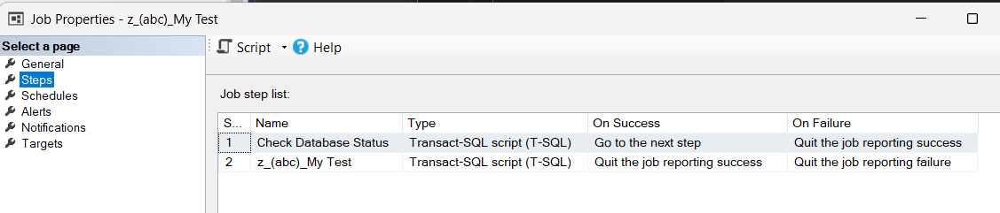
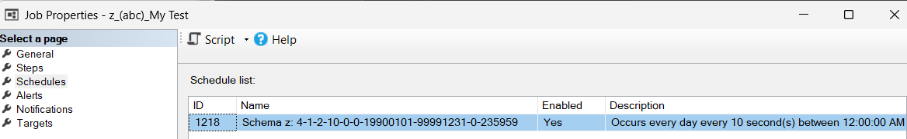
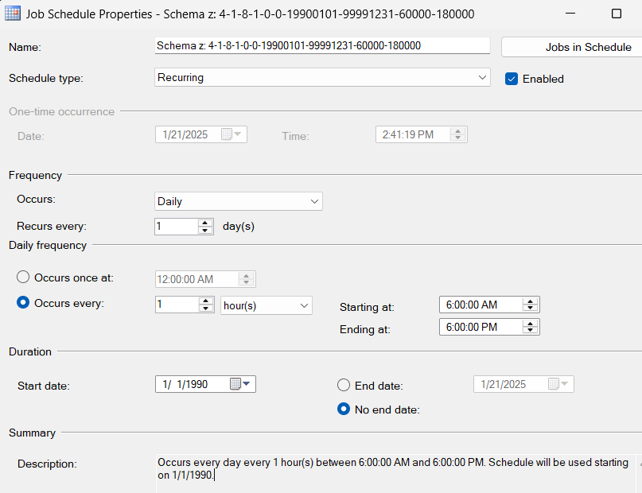
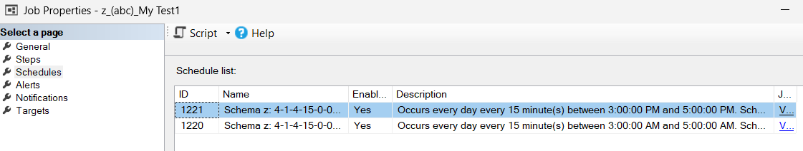
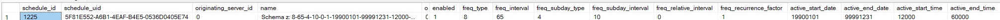
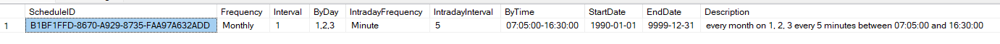
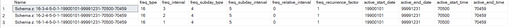
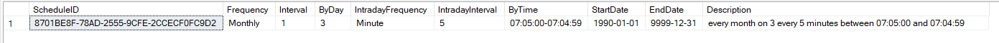
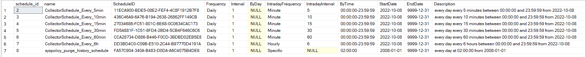

SQL Server Agent jobs are widely used for automating routine tasks. While SQL Server Management Studio (SSMS) provides a graphical interface for job management, the programming interface for SQL Agent jobs often lacks user-friendliness. This is understandable, as SQL Server caters to both DBAs and developers, addressing a broad range of use cases. Features like job notification and operators may be vital for DBAs, but are often irrelevant to developers. 

Despite this, creating jobs and job steps programmatically using system-defined procedures is not overly complicated, Procedure [sp_add_job](https://learn.microsoft.com/en-us/sql/relational-databases/system-stored-procedures/sp-add-job-transact-sql) and [sp_add_job_steps](https://learn.microsoft.com/en-us/sql/relational-databases/system-stored-procedures/sp-add-jobstep-transact-sql) can be used to define jobs and their steps. However, adding job steps involves specifying complex actions based on the success or failure of preceding steps.

The most challenging aspect is defining job schedules. For this, [sp_add_jobschedule](https://learn.microsoft.com/en-us/sql/relational-databases/system-stored-procedures/sp-add-jobschedule-transact-sql) must be utilized. This procedure requires an in-depth understanding of various parameters, such as `@freq_type`, `@freq_sub_type`, and `@freq_relative_interval`. Additionally, parameters like the `active_start_time` must be converted from datetime to integer format. Even after successfully configuring everything, verifying the schedule - open using SSMS - is essential to ensure it matches your intentions. for instance, SSMS might display:
```
Occurs every day every 10 minute(s) between 12:00:00 AM and 11:59:59 PM. Schedule will be used starting on 7/20/2017.
```

The undocumented procedure `sp_get_schedule_description` can retrieve the description. However, it's not officially supported by Microsoft. The officially documented procedure [sp_help_jobschedule](https://learn.microsoft.com/en-us/sql/relational-databases/system-stored-procedures/sp-help-jobschedule-transact-sql) can also be used, but it comes with limitations. For example, if a schedule is associated with multiple jobs, you must provide the specific job ID or name.

The most frustrating thing is maintaining and reviewing such code. Revisiting the code often requires referencing Microsoft documentation to decode the numeric parameters. Since job scheduling is not an everyday task for most developers, it's easy to forget how to use after a few days or weeks.

**Simplifying the Complexity: Schema z Service Jobs**

To address these challenges, I developed a set of stored procedures under `Schema z` to simplify job creations and scheduling.  These procedures wrap the complexities of SQL Server agent job with limitations. For example: one job step only and no notification settings

One example of this implementation is the procedure procedure [z.usp_RemoveBlocker](References#zusp_removeblocker), This procedure demonstrates how to create a job to kill the sessions blocking the current session and job removes itself two seconds after the current session becomes inactive.

# The Basics

In Schema z, the serivce job name is defined as `z_(DatabaseName)_ServiceName` which can be generated using function  [z.fn_GetServiceJobName](References#zfn_getservicejobname). When a service job has already been created, the SQL Agent job ID can be retrieved by function [z.fn_GetServiceJobID](References#zfn_getservicejobid). To get basic job informtion, , use view [z.v_ServiceJobs](References#zv_servicejobs).

To start a service job, invoke procedure [z.usp_StartServiceJob](References#zusp_startservicejob). To stop a service job, use procedure [z.usp_StopServiceJob](References#zusp_stopservicejob). To enable or disable a service job, use procedure [z.usp_EnableServiceJob](References#zusp_enableservicejob) and [z.usp_DisableServiceJob](References#zusp_disableservicejob), respectively. To remove a service job, use [z.usp_CreateServiceJob](References#zusp_removeservicejob).

# Create a Job

Procedure [z.usp_CreateServiceJob](References#zusp_createservicejob) allows you to create job with a single step and the schedule you need. Internally, it creates the first step that skips the job execution if the database is not accessible. For example, the job is created when the database is online, but at the time of execution, the database becomes an inaccessible secondary database under AlwaysOn scenario. 

In this example, a service job called `My Test` is created. The job will run every 10 seconds daily.
``` sql
use abc
go
exec z.usp_CreateServiceJob @Name = 'My Test', @Command = 'select 1'
```





To start a asynchronous process, you can create a job with the work load, configure it to remove itself after execution, and then start the job. In this case, the frequency is `Daily`. Avoid using `10 seconds` because the job will not be started promptly as with `Daily`. Do not run it within a transaction. 

``` sql
use abc
go
declare @Command nvarchar(max)= 'YourWorkLoad', @MyServiceJobName varchar(100) = 'Service Job for Session ' + cast(@@spid as varchar(100)) + '-' + cast(newid() as varchar(100))
exec z.usp_CreateServiceJob @Name = @MyServiceJobName, @Command = @Command, @DeleteAfterExecution = 3, @Frequency = 'Daily'
exec z.usp_StartServiceJob @Name = @MyServiceJobName
```

Create a job to run every hour between `6 AM` and `6 PM` daily. 
``` sql
use abc
go
exec z.usp_CreateServiceJob @Name = 'My Test1', @Command = 'select 1', @Frequency = 'Daily', @Interval = 1, @IntradayFrequency = 'Hourly', @IntradayInterval = 1,@ByTime = '6:00-18:00'
```


Following example creates a job scheduled to execute every 15 minutes daily between `3 AM` and `5 AM` and `3 PM` and `5 PM`. If a job with the same name already exists, it is updated with the new schedules. In this case, two SQL Job schedules are created.
``` sql
use abc
go
exec z.usp_CreateServiceJob @Name = 'My Test1', @Command = 'select 1', @Frequency = 'Daily', @Interval = 1, @IntradayFrequency = 'minute', @IntradayInterval = 15, @ByTime = '3:00-5:00,15:00-17:00'
```


# Schedules

In SQL Agent, schedules are defined using 10 integer-type parameters which are not very intuitive. In Schema z, the schedule is defined by 8 parameters, mixing integers and strings. It contains 3 main sections: None Intraday Frequency, Intraday Frequency, and Life Cycle. 

Procedure [z.usp_CreateSchedule](References#zusp_createschedule) creates one or multiple SQL Agent Job Schedules based on the parameters defined. The Job Schedules have been defined already in SQL Agent will be skipped. Procedure [z.usp_RemoveOrphanedSchedule](References#zusp_removeorphanedschedule) removes the SQL Agent Schedules created by Schema z that are not associated with any jobs.
``` sql
exec z.usp_CreateSchedule @Frequency = 'Weekly', @Interval = 1, @ByDay= 'Saturday,Sunday', @IntradayFrequency = 'Minute', @IntradayInterval = 10, @ByTime = '1:20-6:00', @StartDate = null, @EndDate = null, @ScheduleNames = null
select * from msdb.dbo.sysschedules where name like 'Schema z:%'
exec z.usp_RemoveOrphanedSchedule
```



The function [z.fn_CleanseScheduleParameter](References#zfn_cleansescheduleparameter) verifies and standardize the parameters for Schema z schedule. It also returns description and ScheduleID which is an MD5 Hash value of all the standardized parameters. This ensures the same parameter sets always generate the same hash value.  If the schedule entered is incorrect, no records will be returned.

``` sql
select * 
from z.fn_CleanseScheduleParameter('m', 1, '1,2,3', 'm', 5, '7:05-16:30', null, null)
```



The function [z.fn_ToSQLAgentSchedule](References#zfn_tosqlagentschedule) returns the number of SQL Agent schedules will be created from a Schema z schedule. In following example, three SQL Agent schedules are returned. 
``` sql
select * 
from z.fn_ToSQLAgentSchedule('m', 1, '1,2,3', 'm', 5, '7:05', null, null)
```


The Schema z schedule name contains the definition of the schedule. Funciton [z.fn_ParseScheduleName](References#zfn_parseschedulename) extracts schedule definition from the schedule name.
``` sql
select * 
from z.fn_ParseScheduleName('Schema z: 16-3-4-5-0-1-19900101-99991231-70500-70459')
```


The funciton [z.fn_FromSQLAgentSchedule](References#zfn_fromsqlagentschedule) can be used to return Schema z schedules from SQL Agent schedules.
``` sql
select s.schedule_id, s.name, z.*
from msdb.dbo.sysschedules s
	cross apply z.fn_FromSQLAgentSchedule(s.freq_type, s.freq_interval, s.freq_subday_type, s.freq_subday_interval, s.freq_relative_interval, s.freq_recurrence_factor, s.active_start_date, s.active_end_date, s.active_start_time, s.active_end_time) z
```



## None Intraday Frequency
None Intraday Frequency defines the days or specific events a job can be started.
- `Frequency`: **Monthly**: Specifies a monthly interval. Other acceptable keywords: `Months`, `Month`, `MM`, `Mon`, or `M`.
    - `Interval`: A numeric value indicating number of months
    - `ByDate`: Specifies days within  a month. 
        - By week: Use `First` or `1st`, `Second` or `2nd`, `Third` or `3rd`, `Forth` or `4th`, and `Last` to specify the week of the month. Combine these with `Monday` or `Mon`, `Tuesday` or `Tue`, `Wednesday` or `Wed`, `Thursday` or `Thu`, `Friday` or `Fri`, `Saturday` or `Sat`, `Sunday` or `Sun`, `Weekday`, and `Weekend`. Multiple days can be separated by comma (e.g., `First Sunday, Second Monday`).
        - By day: Use numeric values range from `1-31` or keywords `FirstDay` or `1stDay`, `SecondDay` or `2ndDay`, `ThirdDay` or `3rdDay`, `ForthDay` or `4thDay`, `LastDay`. Specifying multiple days using comma(e.g., `First Sunday, Second Monday, 1, 2, 3, 4, lastday`).
- `Frequency`: **Weekly**: Specifies a Weekly interval. Other acceptable keywords: `Weeks`, `Week`, `WK`, or `W`.
    - `Interval`: A numeric value indicating number of weeks.
    - `ByDate`: Specifies days of the week. Use `Monday` or `Mon` or `1`, `Tuesday` or `Tue` or `2`, `Wednesday` or `Wed` or `3`, `Thursday` or `Thu` or `4`, `Friday` or `Fri` or `5`, `Saturday` or `Sat` or `6`', and `Sunday` or `Sun` or `7` to specify a day. Multiple days can be separated by comma (e.g.,`1, 2, Sun`).
- `Frequency`: **Daily**: Specifies a daily interval. Other acceptable keywords: `Days`, `Day`, `DD` or `D`.
    - `Interval`: A numeric value indicating number of days.
    - `ByDate`: Not Applicable
- `Frequency`: **Specific**: Specifies exact datetimes. Other acceptable keywords: `one`, `once`, `adhoc`, and `custom`.
    - `Interval`: Not Applicable
    - `ByDate`: A list of the datetimes in the format `yyyy-mm-dd hh:mi:ss` separated by comma (e.g, `2025-01-02 13:25, 2026-01-04 16:33`).
- `Frequency`: **Start**: Specifies execution when SQL Agent Starts. Other acceptable keywords: `AgentStart`, `SQLAgentStart`, and `S`
    - `Interval`: Not Applicable
    - `ByDate`: Not Applicable
- `Frequency`: **Idle**: Specifies execution when the computer is idle. Other acceptable keywords: `I`

## Intraday Frequency
Intraday Frequency specifies a time when events occur. It applies when `Frequency` is set to `Daily`, `Weekly`, or `Monthly`.
- `IntradayFrequency`: Values include **Hourly**, **Minute**, **Second**, and **Specific**.
- `IntradayInterval`: A numeric value indicating number of Hour, Minute, or Second. When `IntradayFrequency` value is `Specified`, this value is not applicable.
-`ByTime`: Specifies times in format `hh:mi:ss`, separated by comma. To Define time periods, use `hh:mi:ss-hh:mi:ss-hh:mi:ss-hh:mi:ss`. For multiple time periods, separate them with commas(e.g., `3:30-5:30, 15:30-17:30`)

## Life Cycle
Life Cycle defines the active time period for a schedule.
- `StartDate`, default is `null` (`1970-01-01`).
- `EndDate`, default is `null` (`9999-12-31`).
